# Task 1. Install Docker

Done in scope of the first homework (jenkins).
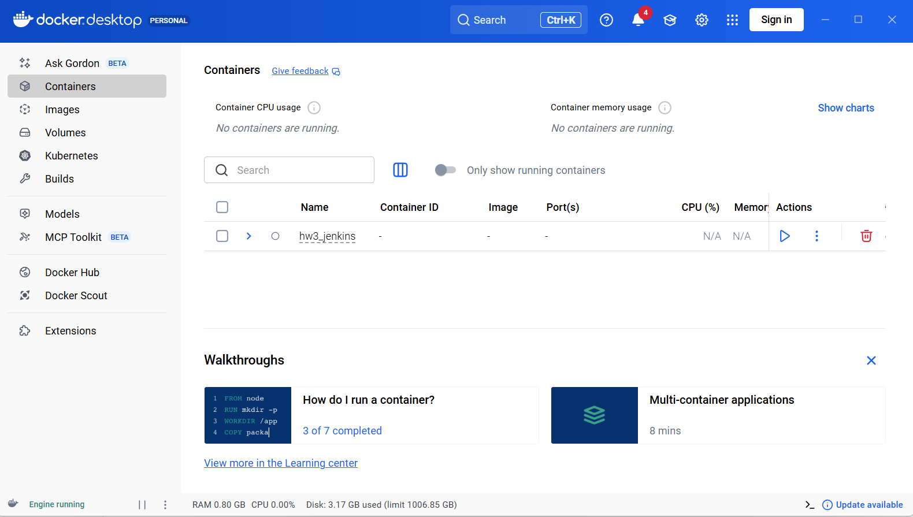

# Task 2. Create docker-compose.yml

[docker-compose.yml](multi-container-app/docker-compose.yml)


# Task 3. Start the multi-container app.

Run docker compose up -d
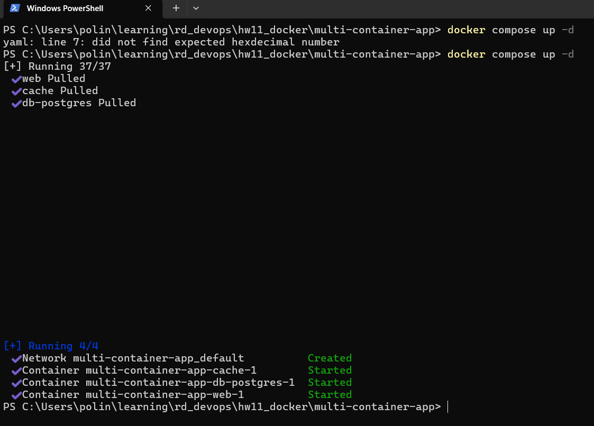

The postgres service exited(1):
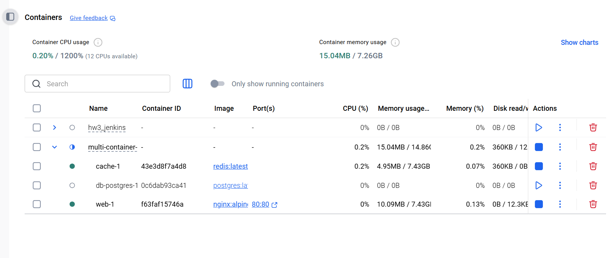

I executed
```
docker logs <postgres container ID>
```
and got
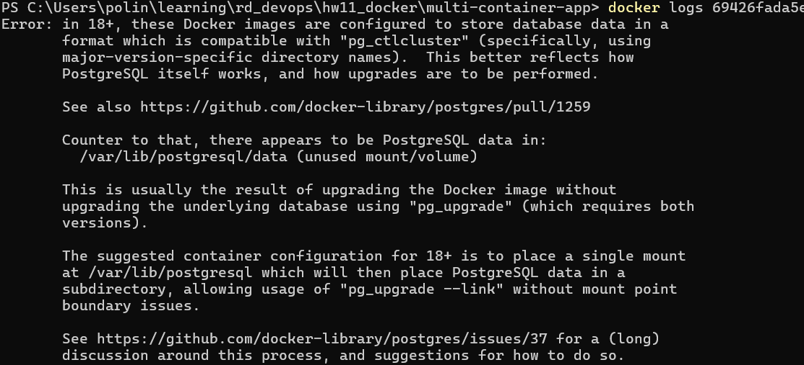

So the `latest` postgres version that I chose has changes, and now requires different structure for volumes.
The volumes is defined as:
```
    volumes:
      - db-data:/var/lib/postgresql/data
```
but since Postgres 18 the directories must be versioned.

So I remove the containers and volumes:
```
docker compose down -v
```
And downgrade postgres to v16 (because it's easier :) )
Now all services are up and running
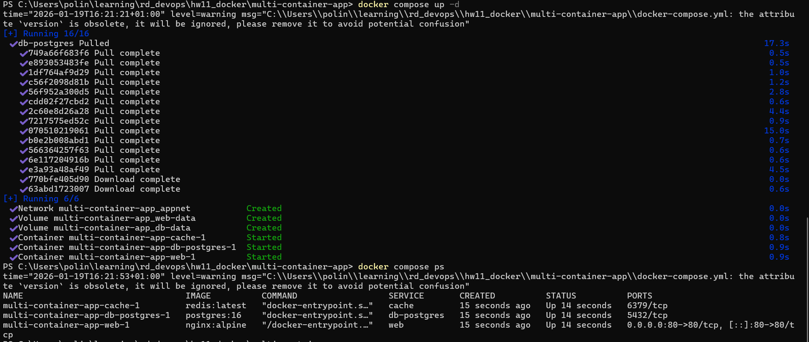
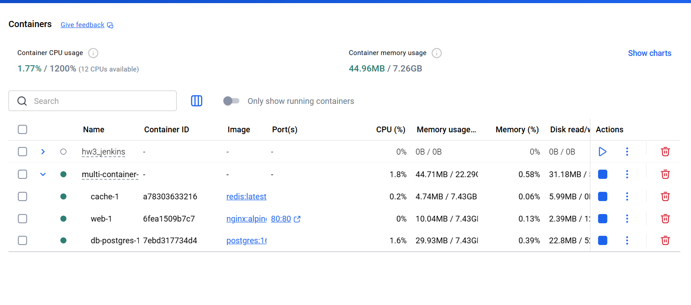

Checking localhost:8080


At first it didn't work, because I initially mapped nginx ports as "80:80", and not "8080:80".
So I changed the mapping and restarted containers, now the ports are correct:
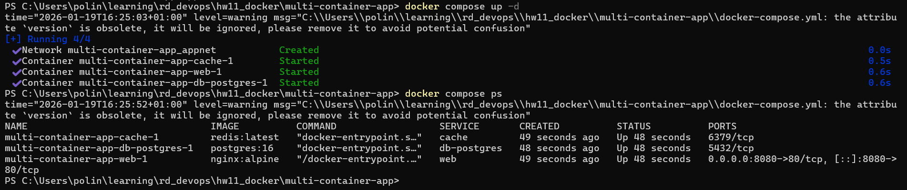

# Task 4. Configure network and volumes.

1. Inspect created networks and volumes.
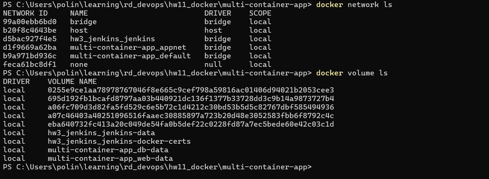

2. Check connection to the db.
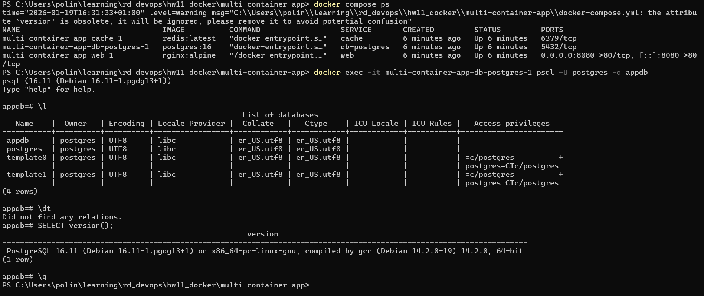

# Task 5. Scaling.

1. Run
```
docker-compose up -d --scale web=3
```
but scaling can't work with the defined "ports" in the docker-compose.
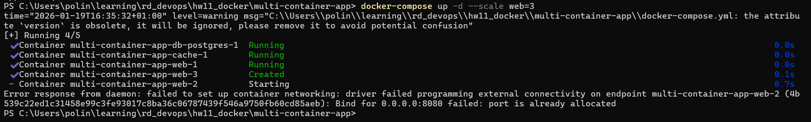
For scaling a port must be defined only for one container.
So I removed "ports" from docker compose, and then could start all containers:
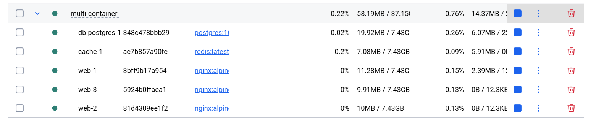

In "real world" there must be a load balancer with a single port, and it'd balance the load between the three web services.

2. Check the status of the containers:
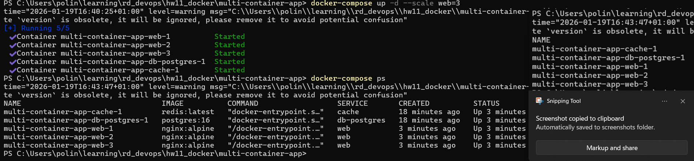