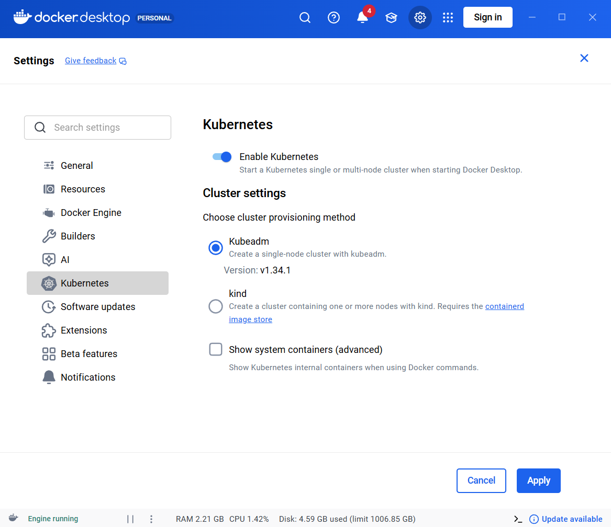
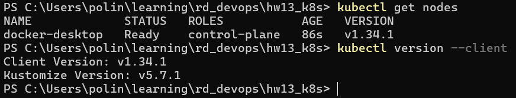
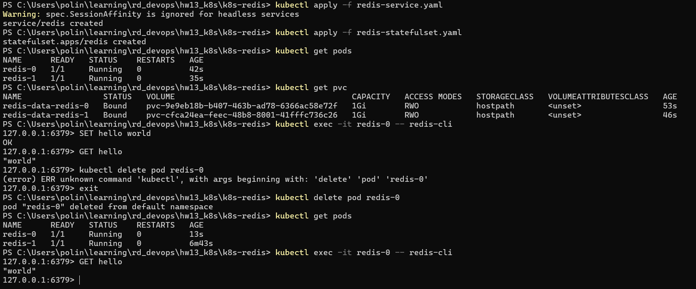
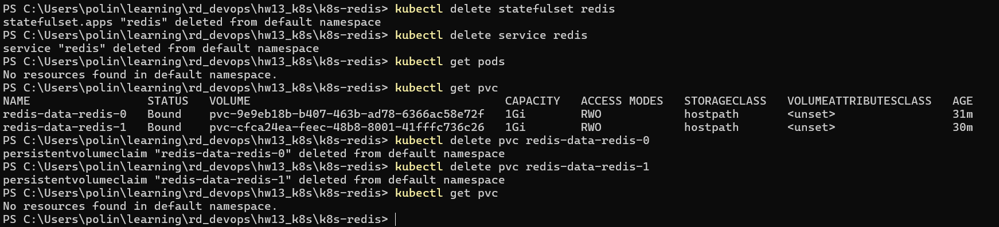
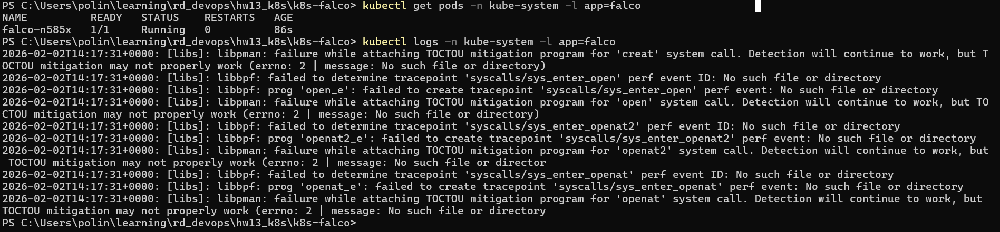

# Task1: Create StatefulSet for Redis cluster

0. Setting up prerequisites.
Installed wsl, docker  desktop. In the docker desktop settings enabled k8s.




1. Create service for redis - [redis-service.yaml](k8s-redis/redis-service.yaml).

Specify kind (service), metadata:name (to be referenced by stateful set for stable DNS record for the pods),
and `spec: clusterIP: None` to make the service headless (required by stateful set to provide stable network identities).
```
  selector:
    app: redis
```
`selector` determines which pods belong to this Service, `app: redis` Matches pods with the label app=redis.

`ports` defines which ports the service exposes, port 6379 is default redis port for clients.
`name: redis` assigns a name to the port. Named ports improve readability and can be referenced by other Kubernetes objects.

2. Create stateful set - [redis-statefulset.yaml](k8s-redis/redis-statefulset.yaml).

`kind: StatefulSet` - indicates that this workload manages stateful applications requiring stable identity and storage.

```
metadata:
  name: redis
```
The base name for the StatefulSet. Pods will be named sequentially: redis-0, redis-1.

```
spec:
  serviceName: redis
```
References the headless Service. This is mandatory for StatefulSets and is used to generate stable DNS records for each pod.

`replicas: 2` - two Redis pods should be created.

```
  selector:
    matchLabels:
      app: redis
```
`selector` defines which pods are managed by this StatefulSet.
`matchLabels` - must match the labels in the pod template exactly.

```
  template:
    metadata:
      labels:
        app: redis
```
`template` describes the pod specification, `labels` are applied to each pod and used by both the Service and StatefulSet selector.

```
    spec:
      containers:
      - name: redis
        image: redis:7
```
`containers` - list of containers in the pod.
`name: redis` - name of the container.
`image: redis:7`- uses the official Redis Docker image, version 7.

```
        ports:
        - containerPort: 6379
```
Declares the port Redis listens to inside the container.

```
        volumeMounts:
        - name: redis-data
          mountPath: /data
```
`volumeMounts` - attaches a persistent volume to the container.

`name: redis-data` - references the PersistentVolumeClaim defined later.

`mountPath: /data` - redis stores all persistent data in this directory.

```
        command: ["redis-server"]
        args: ["--appendonly", "yes"]
```
`command` - overrides the default container entrypoint.
`args` - enables Redis Append Only File (AOF) persistence, ensuring data is written to disk.

```
  volumeClaimTemplates:
  - metadata:
      name: redis-data
```
`volumeClaimTemplates` - template for creating a separate PersistentVolumeClaim for each pod.

`name: redis-data` - base name for PVCs (e.g., redis-data-redis-0).

```
    spec:
      accessModes:
      - ReadWriteOnce
```
`accessModes: ReadWriteOnce` - The volume can be mounted as read-write by a single pod, which is ideal for Redis.

```
      resources:
        requests:
          storage: 1Gi
```
Requests 1 gigabyte of persistent storage per pod.

3. Apply the configs and check results.

After applyhing the configs, both pods are running.
Both PVCs are created.
I've stored a key value pair and deleted a pod, but the data was still persisted.


Cleanup:


# Task2: Configure Falco in K8s using DaemonSet

1. Create daemon set - [falco-daemonset.yaml](k8s-falco/falco-daemonset.yaml).

`kind: DaemonSet` - guarantees that pod Falco will be created on each node.

```
metadata:
  name: falco
  namespace: kube-system
  labels:
    app: falco
```

`name: falco` - the name of the DaemonSet
`namespace: kube-system` - system namespace.
`labels` - needed for logs and monitoring.

```
spec:
  selector:
    matchLabels:
      app: falco
```
DaemonSet needs to know which pods it controls, labels in `selector` must match labels from pod `template`.

```
template:
  metadata:
    labels:
      app: falco
```
These labels are linking a pod with the DaemonSet, so we can run
```
kubectl get pods -l app=falco
```

```
containers:
- name: falco
  image: falcosecurity/falco:latest
```
`falcosecurity/falco` - official image.

```
securityContext:
  privileged: true
```
Is a must for falco, otherwise it won't be able to access kernel events.

```
resources:
  limits:
    cpu: "100m"
    memory: "256Mi"
  requests:
    cpu: "100m"
    memory: "128Mi"
```
Required limits.

`volumeMounts` - mounting all directories that Falco needs to monitor.

2.  Apply the configs and check result.
```
 kubectl apply -f falco-daemonset.yaml
```


So Falco does work (warnings show that soem eBPF and TOCTOU features are not available).