# Create a DB and tables
1. Create a db and use it for subsequent statements
```
CREATE DATABASE SchoolDB;
USE SchoolDB;
```
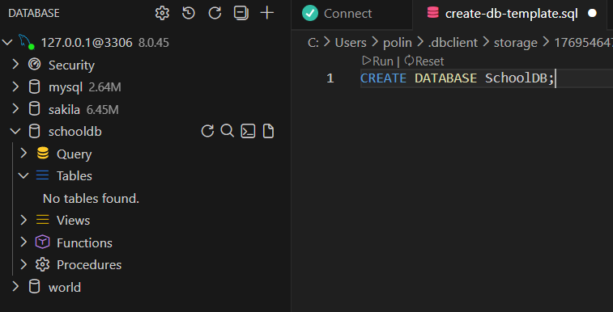

2. Create tables
```
CREATE TABLE Institutions (
    institution_id INT AUTO_INCREMENT PRIMARY KEY,
    institution_name VARCHAR(150) NOT NULL,
    institution_type ENUM('School', 'Kindergarten') NOT NULL,
    address VARCHAR(255) NOT NULL
);

CREATE TABLE Classes (
    class_id INT AUTO_INCREMENT PRIMARY KEY,
    class_name VARCHAR(50) NOT NULL,
    institution_id INT,
    direction ENUM(
        'Mathematics',
        'Biology and Chemistry',
        'Language Studies'
    ) NOT NULL,
    FOREIGN KEY (institution_id)
        REFERENCES Institutions(institution_id)
        ON DELETE CASCADE
);

CREATE TABLE Children (
    child_id INT AUTO_INCREMENT PRIMARY KEY,
    first_name VARCHAR(50) NOT NULL,
    last_name VARCHAR(50) NOT NULL,
    birth_date DATE NOT NULL,
    year_of_entry YEAR NOT NULL,
    age INT NOT NULL,
    institution_id INT,
    class_id INT,
    FOREIGN KEY (institution_id)
        REFERENCES Institutions(institution_id)
        ON DELETE CASCADE,
    FOREIGN KEY (class_id)
        REFERENCES Classes(class_id)
        ON DELETE CASCADE
);

CREATE TABLE Parents (
    parent_id INT AUTO_INCREMENT PRIMARY KEY,
    first_name VARCHAR(50) NOT NULL,
    last_name VARCHAR(50) NOT NULL,
    child_id INT,
    tuition_fee DECIMAL(10,2) NOT NULL,
    FOREIGN KEY (child_id)
        REFERENCES Children(child_id)
        ON DELETE CASCADE
);
```

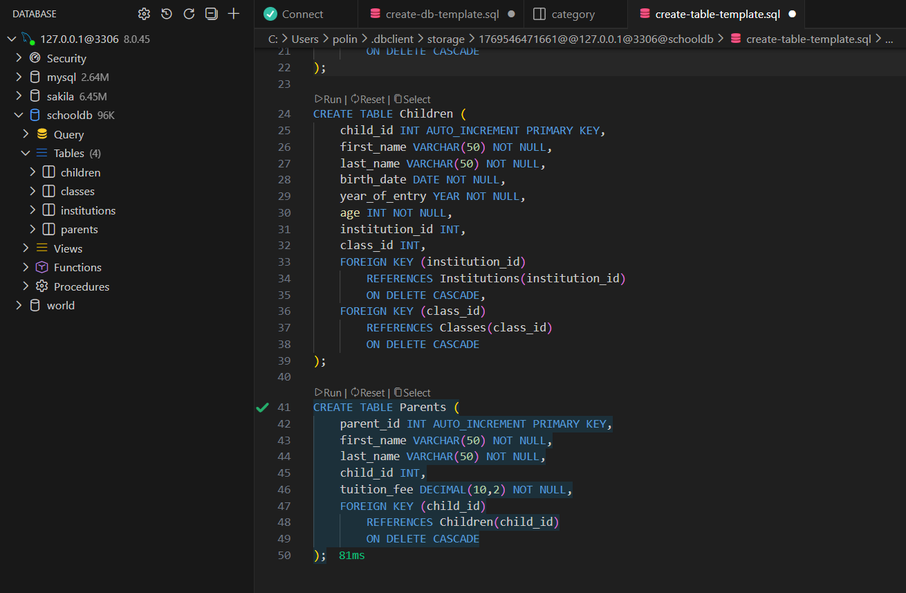


# Insert some data

1. Insert into Institutions
```
INSERT INTO Institutions (institution_name, institution_type, address) VALUES
('Kyiv Lyceum №12', 'School', 'Kyiv, Shevchenka 10'),
('Green Valley Kindergarten', 'Kindergarten', 'Kyiv, Lisova 5'),
('Dnipro Academic School', 'School', 'Dnipro, Centralna 21');
```

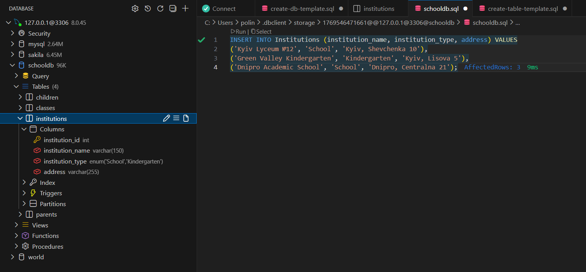

2. Insert into Classes
```
INSERT INTO Classes (class_name, institution_id, direction) VALUES
('5-A', 1, 'Mathematics'),
('6-B', 1, 'Language Studies'),
('Biology Group', 3, 'Biology and Chemistry');
```

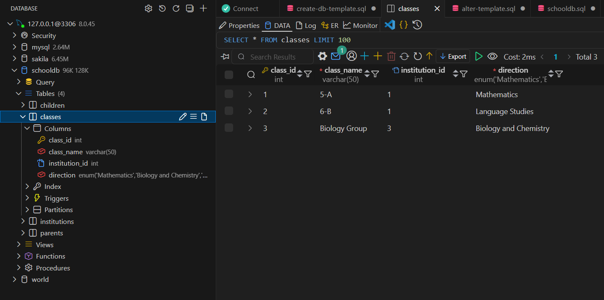

3. Insert into Children
```
INSERT INTO Children
(first_name, last_name, birth_date, year_of_entry, age, institution_id, class_id)
VALUES
('Andrii', 'Petrenko', '2013-05-12', 2020, 11, 1, 1),
('Olena', 'Shevchenko', '2014-09-20', 2021, 10, 1, 2),
('Maksym', 'Koval', '2012-02-03', 2019, 12, 3, 3);
```

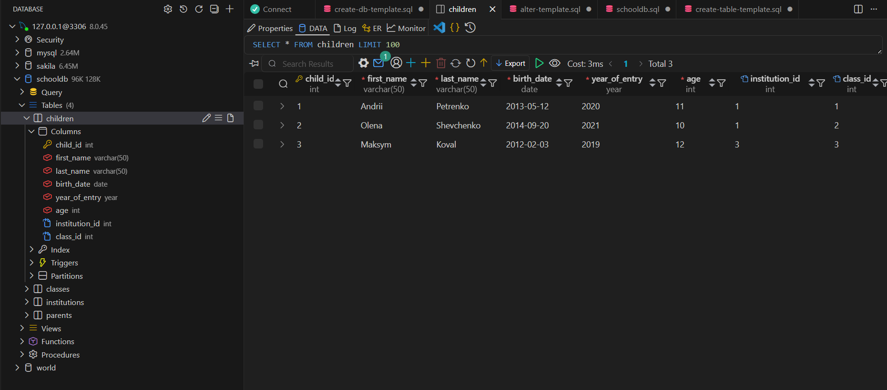

4. Insert into Parents
```
INSERT INTO Parents (first_name, last_name, child_id, tuition_fee) VALUES
('Ivan', 'Petrenko', 1, 18000.00),
('Oksana', 'Shevchenko', 2, 17000.00),
('Serhii', 'Koval', 3, 20000.00);
```

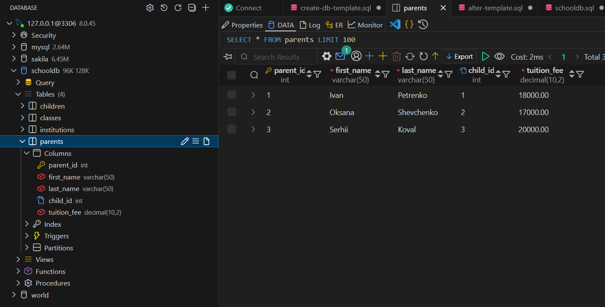

# Select data

1. Select all children with their institution and class direction.
```
SELECT 
    c.first_name,
    c.last_name,
    i.institution_name,
    cl.direction
FROM Children c
JOIN Institutions i ON c.institution_id = i.institution_id
JOIN Classes cl ON c.class_id = cl.class_id;
```

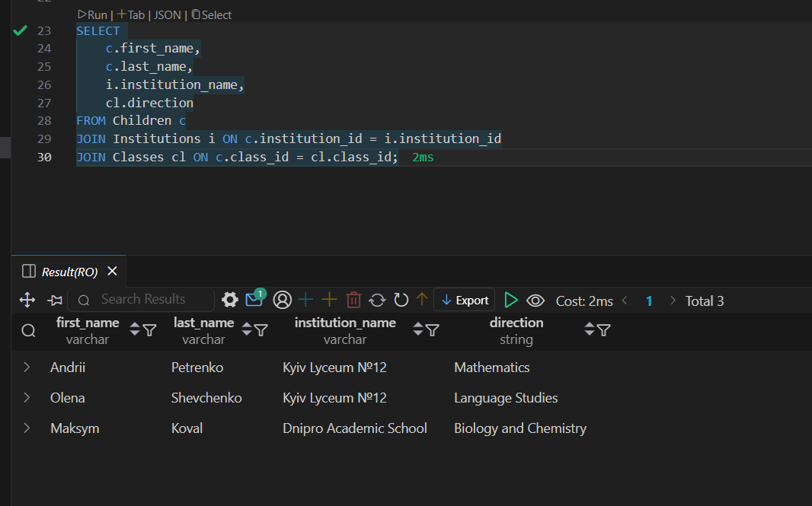

2. Select parents, their kids, and tuition fees
```
SELECT 
    p.first_name AS parent_name,
    p.last_name AS parent_lastname,
    c.first_name AS child_name,
    c.last_name AS child_lastname,
    p.tuition_fee
FROM Parents p
JOIN Children c ON p.child_id = c.child_id;
```

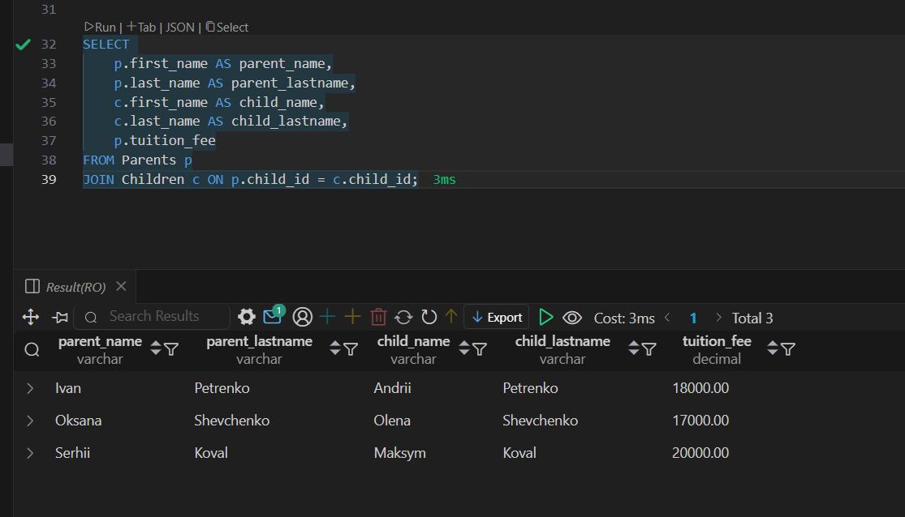

3. Select Institutions with addresses and number of kids:
```
SELECT 
    i.institution_name,
    i.address,
    COUNT(c.child_id) AS number_of_children
FROM Institutions i
LEFT JOIN Children c ON i.institution_id = c.institution_id
GROUP BY i.institution_id;
```

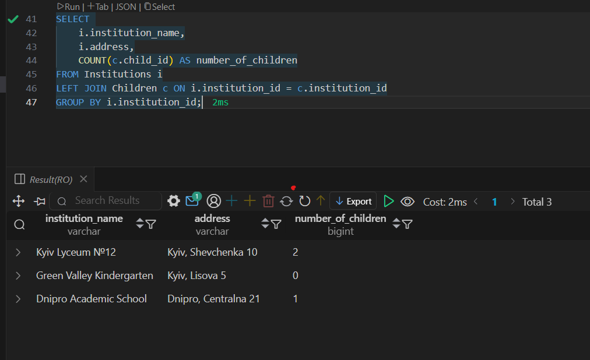

# Backup and restore.
Create new backup:
```
mysqldump -u root -p SchoolDB > schooldb_backup.sql
```
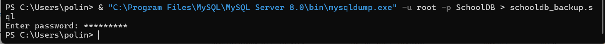

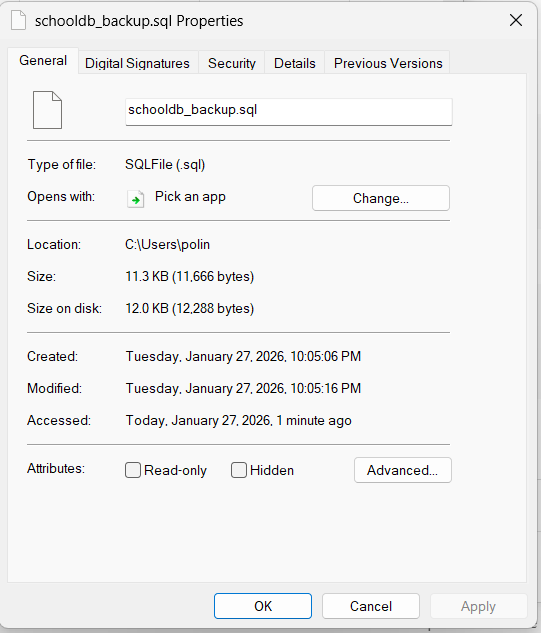

Create new db:
```
CREATE DATABASE SchoolDB_Restore;
```
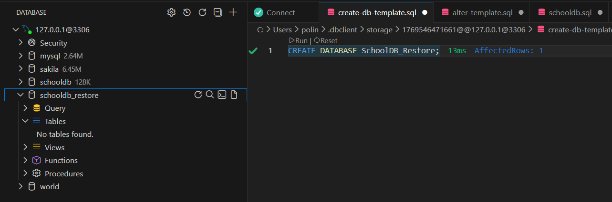

Restore from the Backup:
```
mysql -u root -p SchoolDB_Restore < schooldb_backup.sql

```
I had to change encoding of the backup to utf-8 to continue:
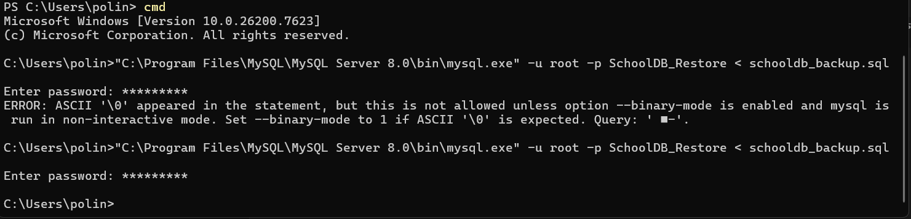
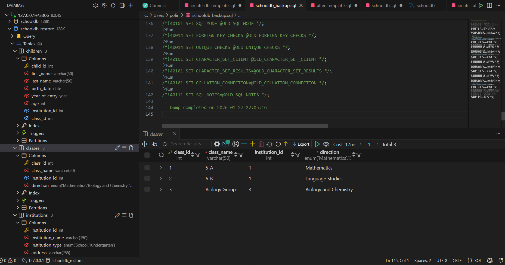


# Extra task: anonimize data

Kids:
```
UPDATE Children
SET 
    first_name = 'Child',
    last_name = 'Anonymous';
```
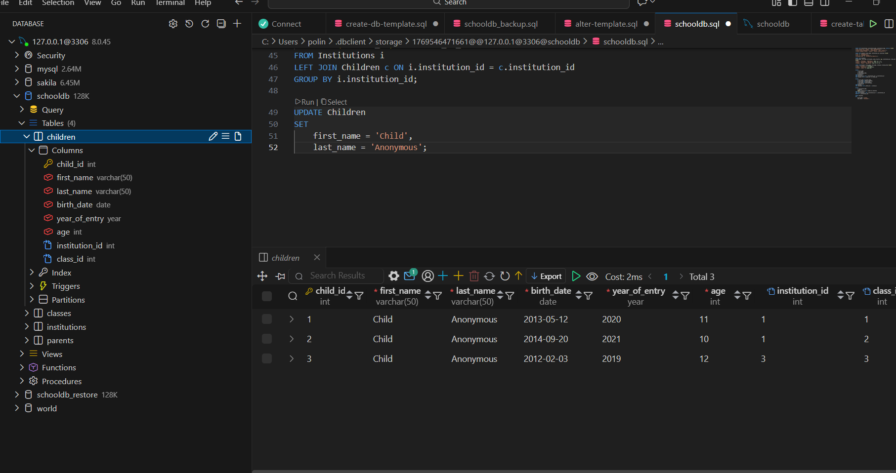

Parents:
```
SET @i = 0;

UPDATE Parents
SET 
    first_name = CONCAT('Parent', (@i := @i + 1)),
    last_name = 'Anonymous';
```
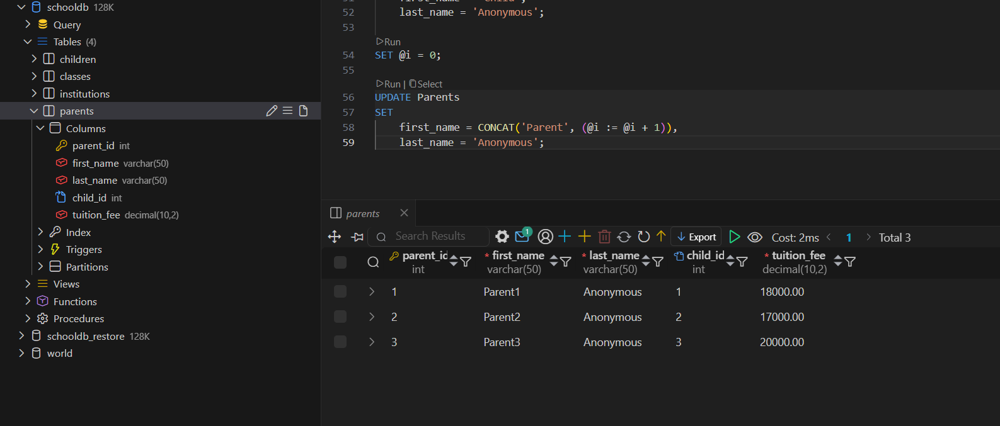

Institutions:
```
SET @n = 0;

UPDATE Institutions
SET institution_name = CONCAT('Institution', (@n := @n + 1));
```
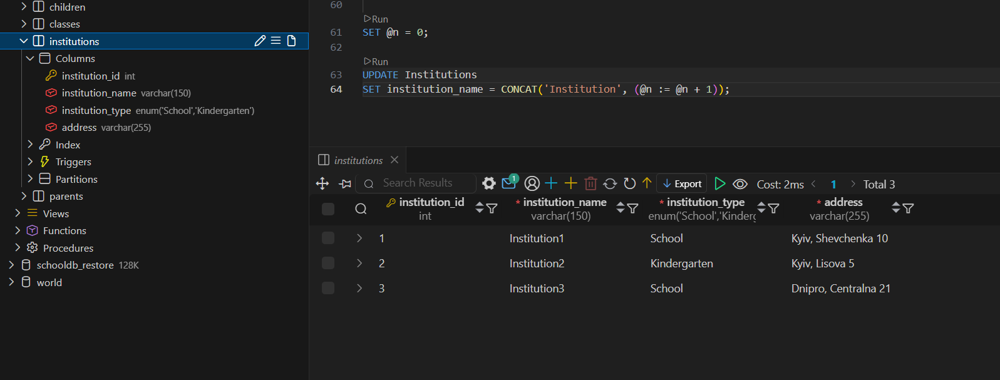

Tuition fees has a random value within 15000-21000 range:
```
UPDATE Parents
SET tuition_fee = FLOOR(15000 + RAND() * 6000);
```
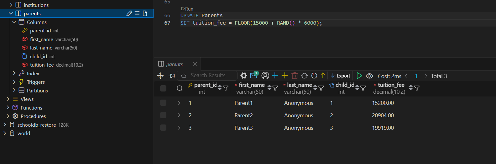
