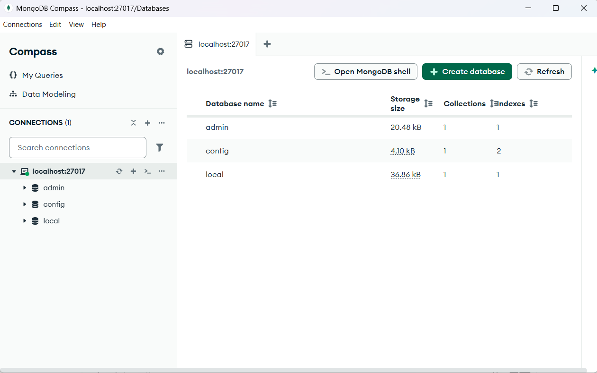
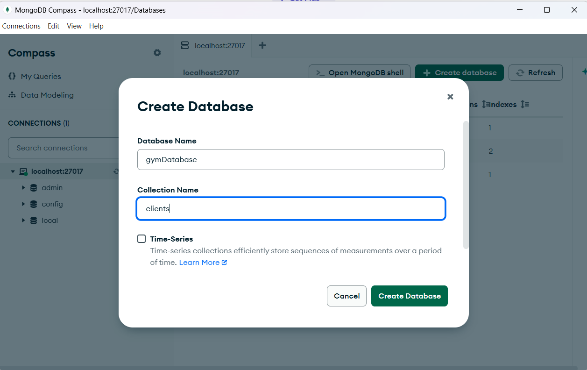
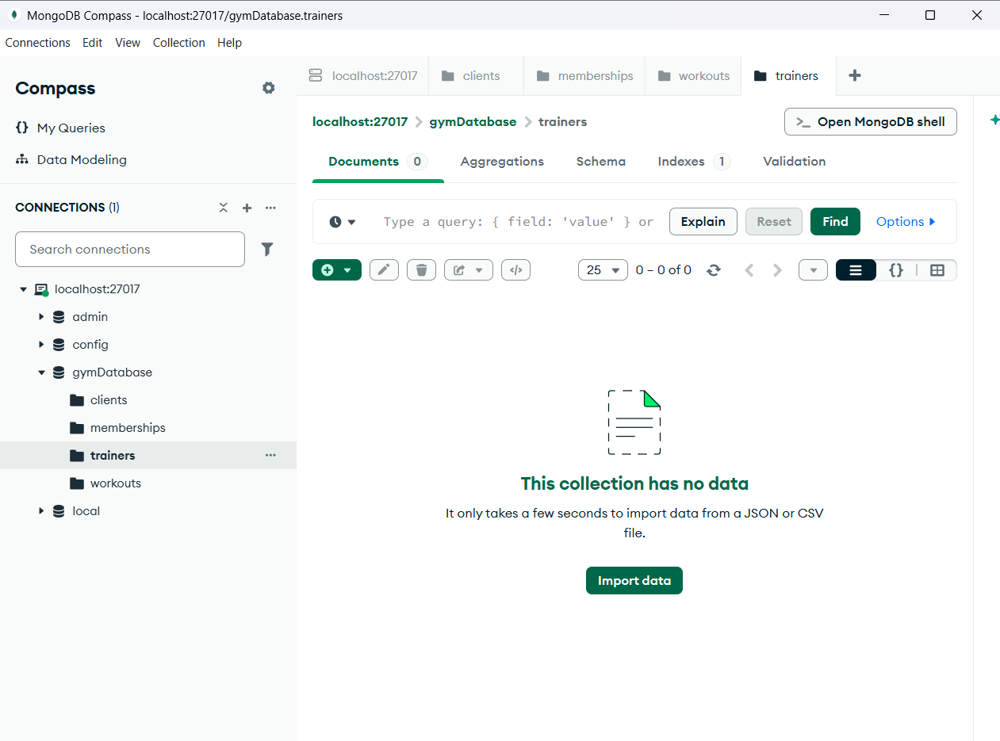
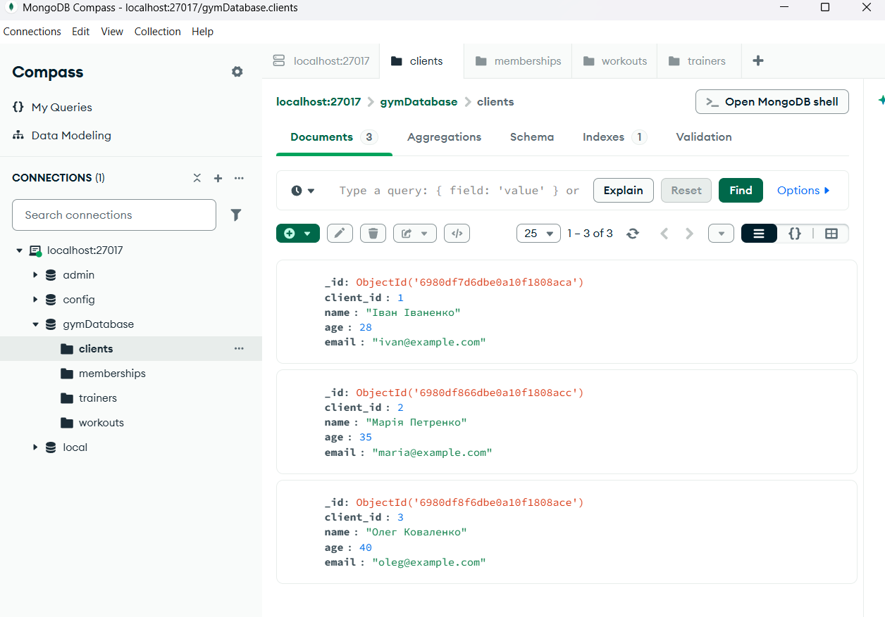
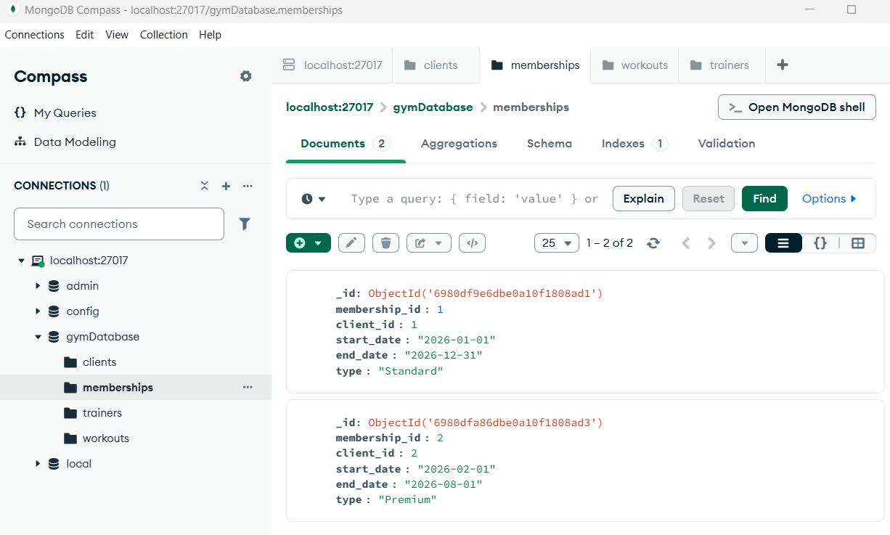
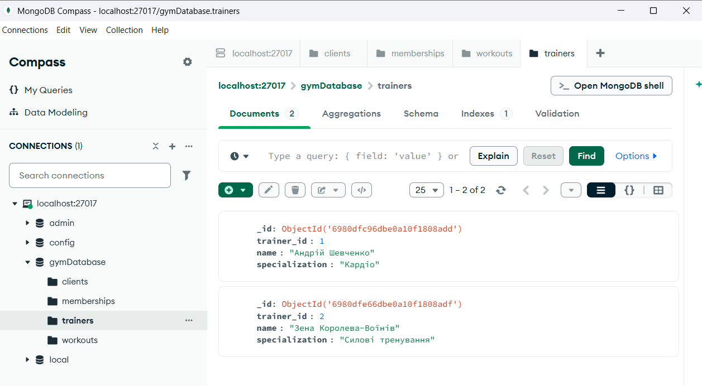
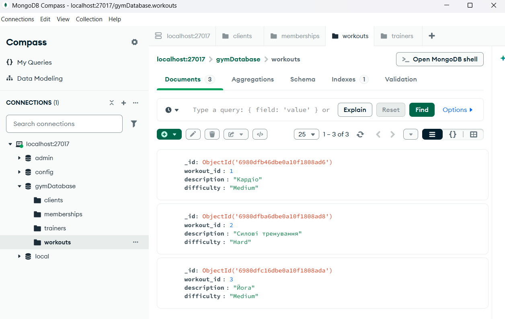
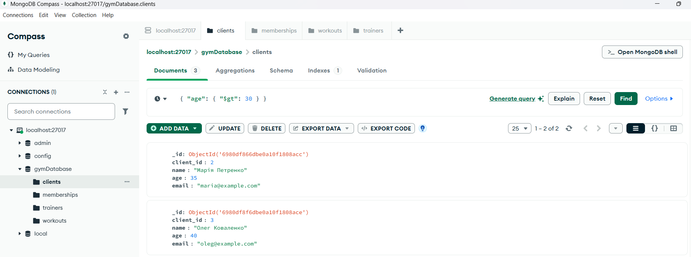
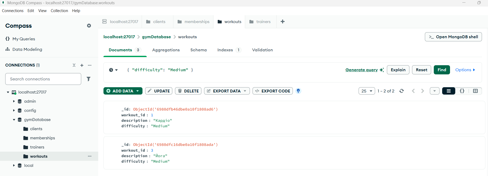
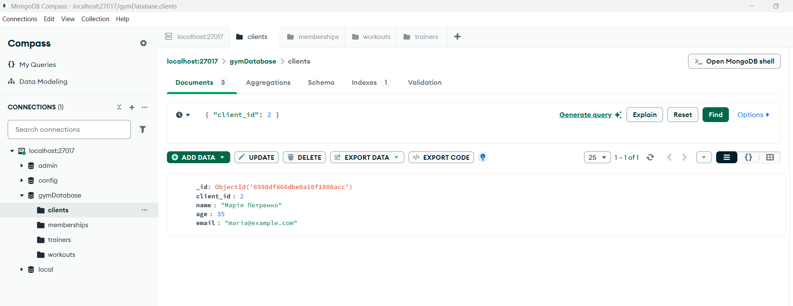

0. Installed mongoDB (with Compass), created a new connection.


1. Create a new DB

and needed collections


2. Fill in the collections





3. Find clients older than 30:
```
{ "age": { "$gt": 30 } }
```


4. Workouts with medium difficulty:
```
{ "difficulty": "Medium" }
```


5. Client with certain id
```
{ "client_id": 2 }
```

