# 0. Prerequisites
Install kubectl and aws cli.

# Task 1. Create EKS cluster.

Log into aws on my local console
```
aws login
```
and approve login via browser.

The default region was us-east-1, so I had to change it
```
 aws configure set region eu-north-1
```

And then I was able to log in.

```
eksctl create cluster --name eks-demo-cluster-pl-cli --region eu-north-1 --node-type t3.medium --nodes 2 --managed
```
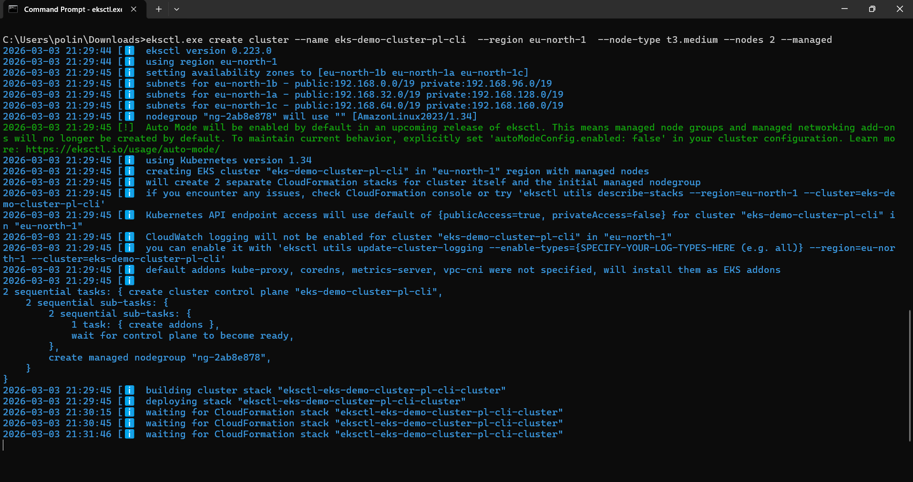

The cluster was created and `kubectl get nodes` returned 2 nodes with status "Ready"
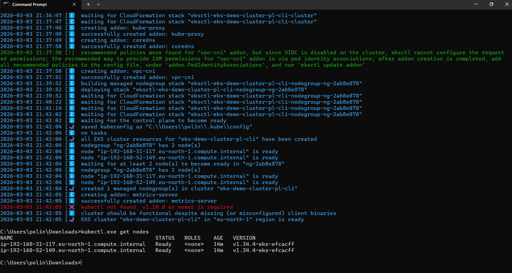

# Task 2. Configure kubectl to access the cluster.

Configures kubectl so that I'm able to connect to an Amazon EKS cluster:
```
 aws eks update-kubeconfig --region eu-north-1 --name eks-demo-cluster-pl-cli
```
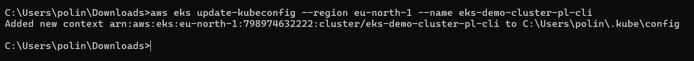

# Task 3. Deploy static website
Create and apply [configmap.yaml](configmap.yaml), [deployment.yaml](deployment.yaml), [service.yaml](service.yaml).

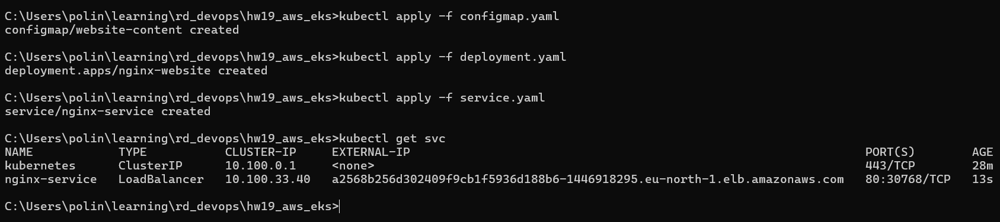

If I open the EXTERNAL IP in browser:


# Task 4. Create PersistentVolumeClaim.
Create and apply [pvc-pod.yaml](pvc-pod.yaml)
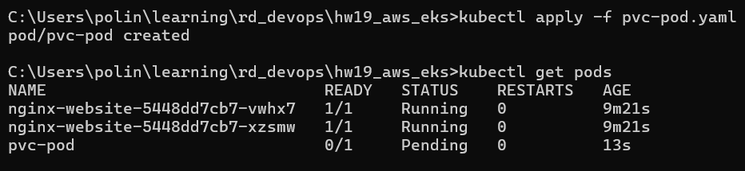

From Amazon Console installed Amazon EBS CSI Driver for the cluster:
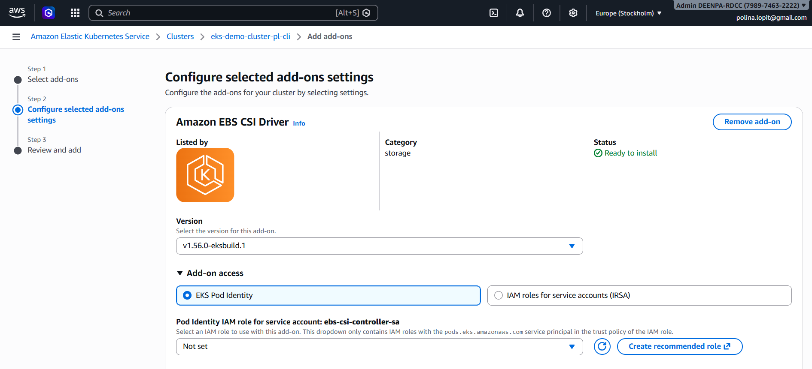
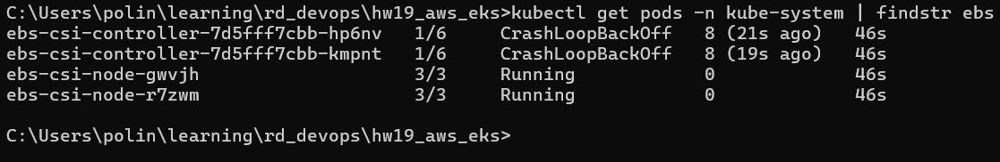

Create and apply [storageclass.yaml](storageclass.yaml), re-apply updated pvc.yaml, re-start the pod:
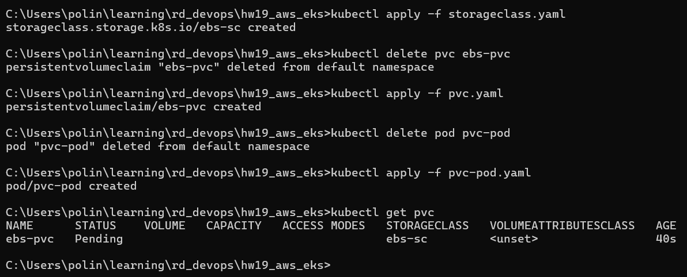


# Task 5. Run Job.
Create and apply [job.yaml](job.yaml).
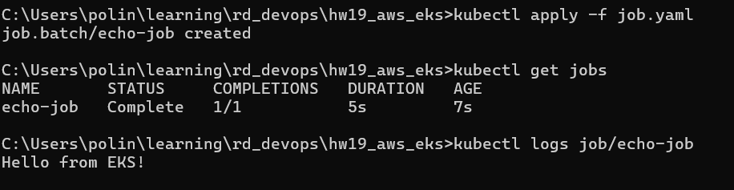

# Task 6. Deploy test app.
Create and apply [test-app-deployment.yaml](test-app-deployment.yaml) and [test-app-service.yaml](test-app-service.yaml):
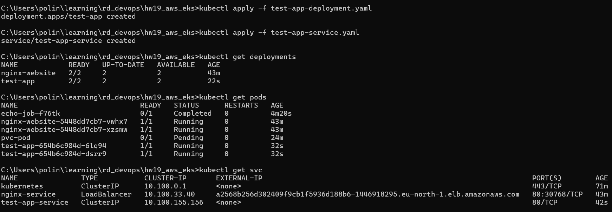

Test:
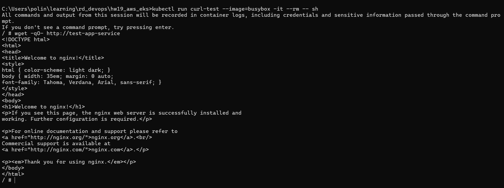

# Task 7. Create namespace.
```
kubectl create namespace dev
```

Create and apply [busybox-dev.yaml](busybox-dev.yaml):
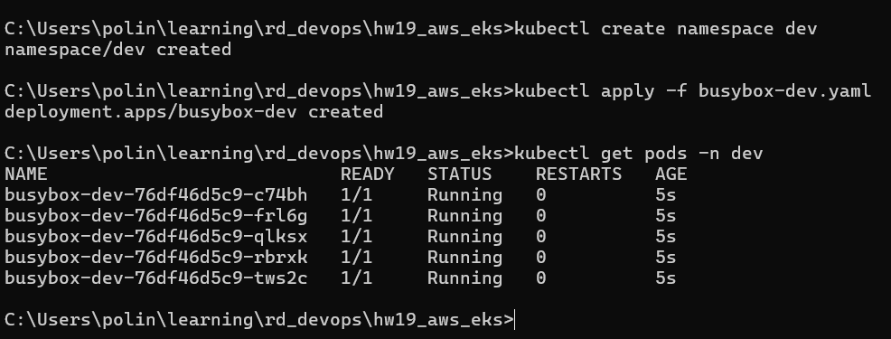

# Task 8. Cleanup resources.

```
kubectl delete namespace dev
kubectl delete deployment nginx-website test-app
kubectl delete service nginx-service test-app-service
kubectl delete pvc ebs-pvc
kubectl delete pod pvc-pod
kubectl delete job echo-job
```
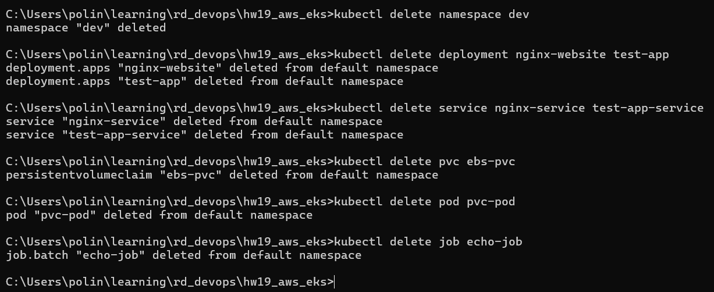

```
eksctl delete cluster --name eks-demo-cluster-pl-cli --region eu-north-1
```
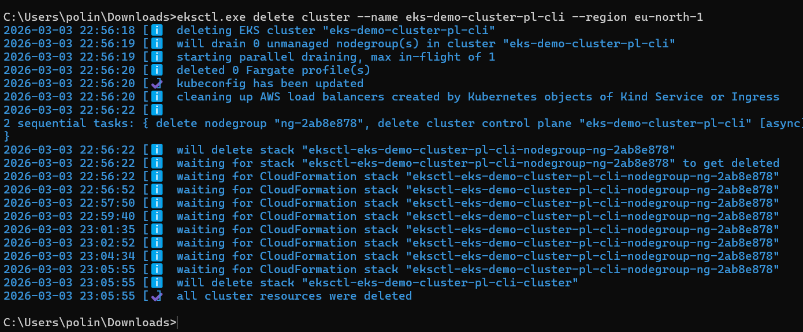
