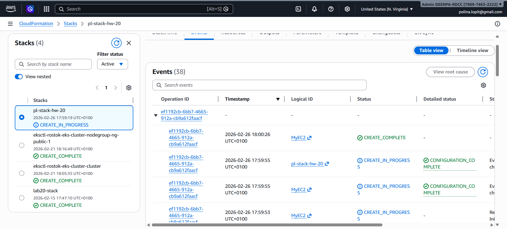
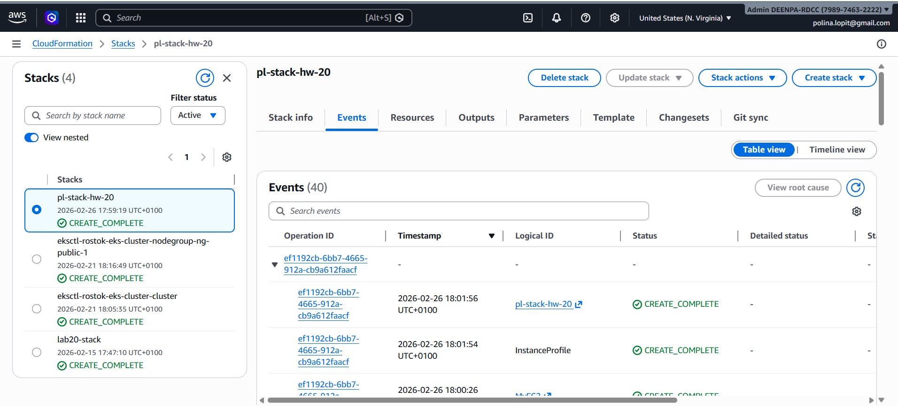
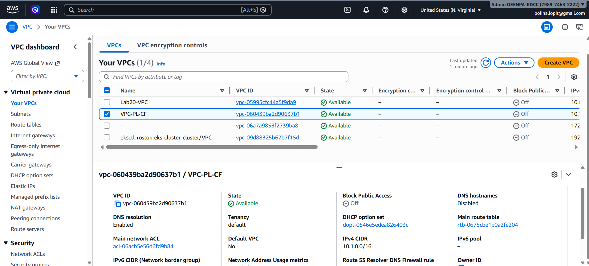
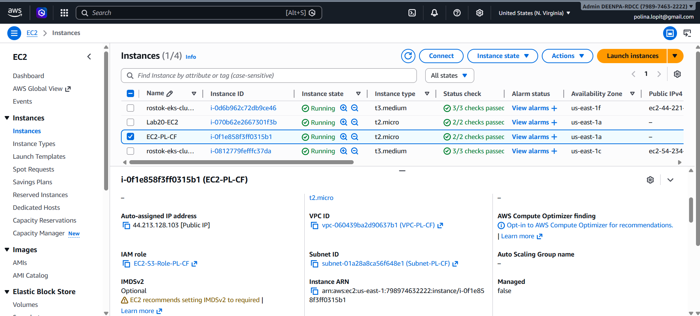
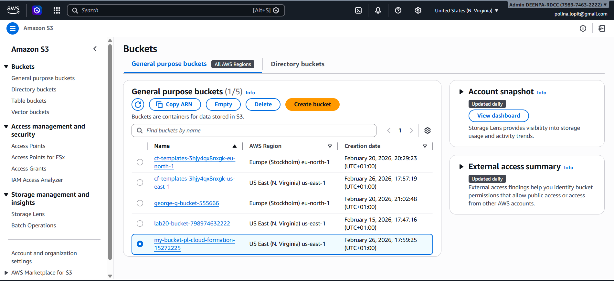
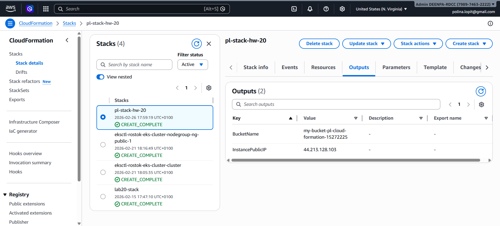
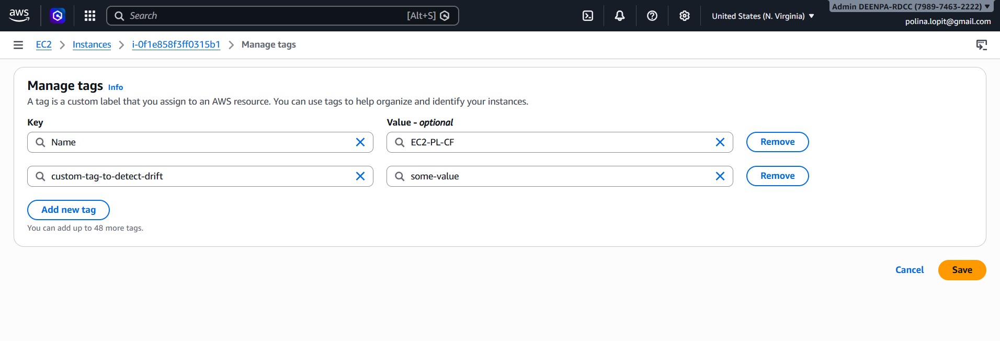
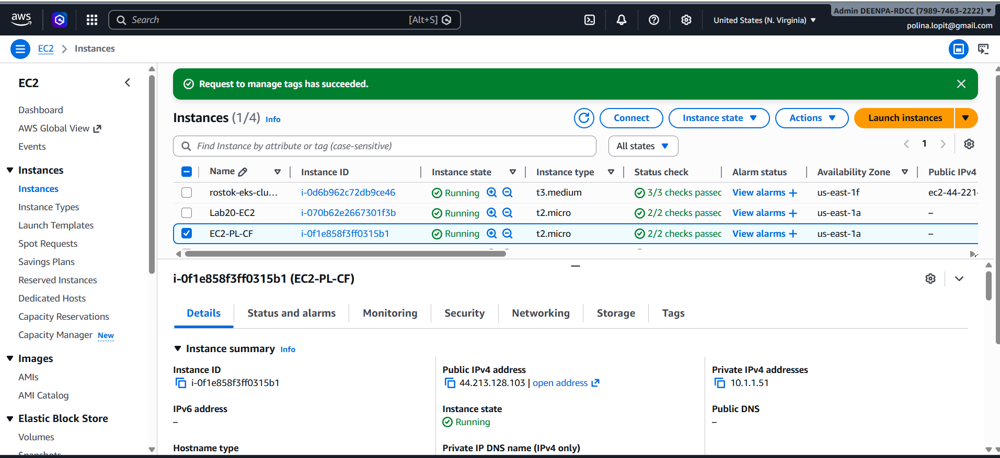
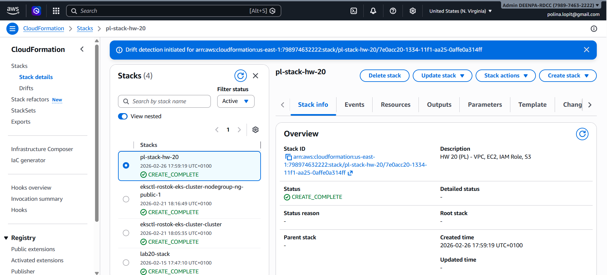
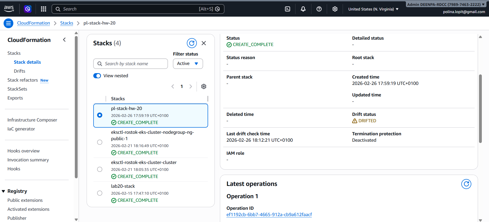

# Configure infrastructure via CloudFormation

1. Create template for a stack:
[template.yaml](template.yaml)

2. Log into AWS console, change region to eu-east-1.

3. Open CLoudFormation service -> Create stack -> With new resources.

Set stack name - "pl-stack-hw-20", and wait for creation to be complete.

4. Verify the results.

VPC -> My VPCs:

EC2 -> Instances:

S3 -> Buckets:

CloudFormation -> Stacks -> pl-stack-hw-20 -> Outputs:

# Extra task - detect drift.

1. Change tag of an EC2:

2. CloudFormation -> Stacks -> pl-stack-hw-20 -> Stack actions -> detect drift.

3. Drift status -> DRIFTED

