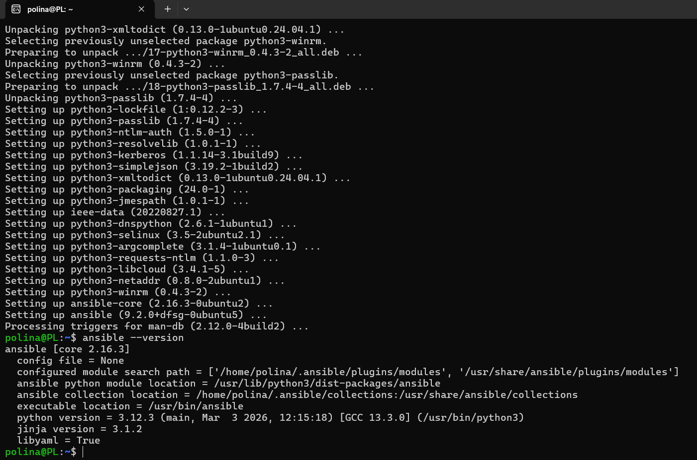
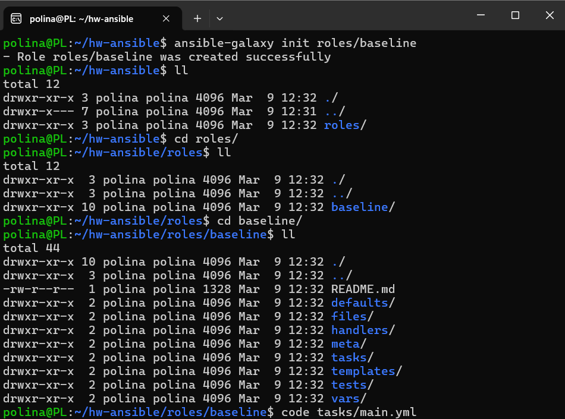
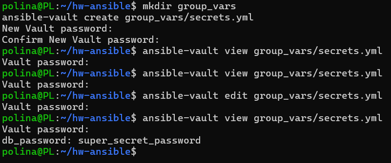
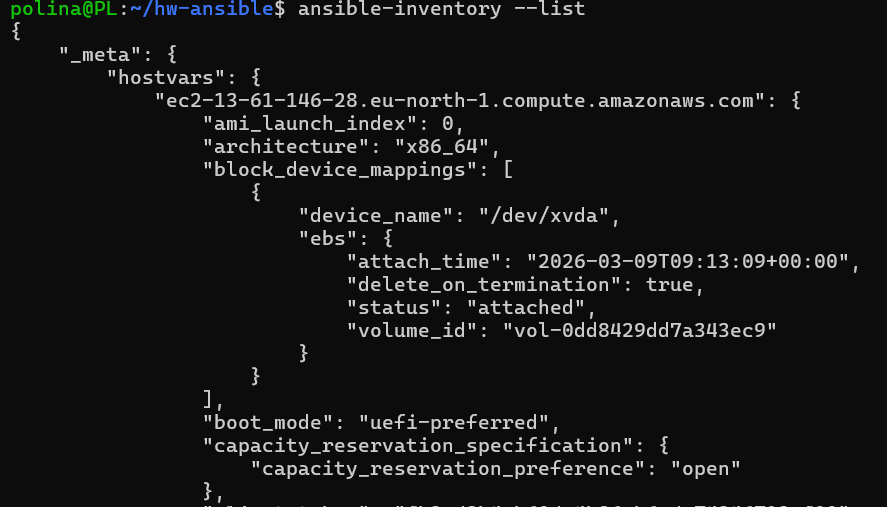
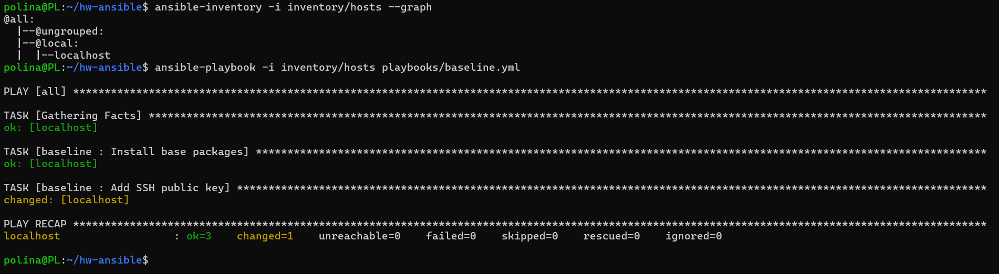
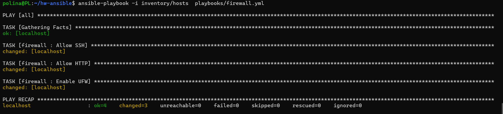
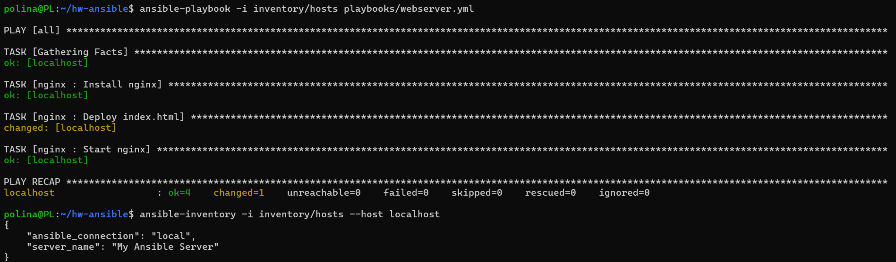
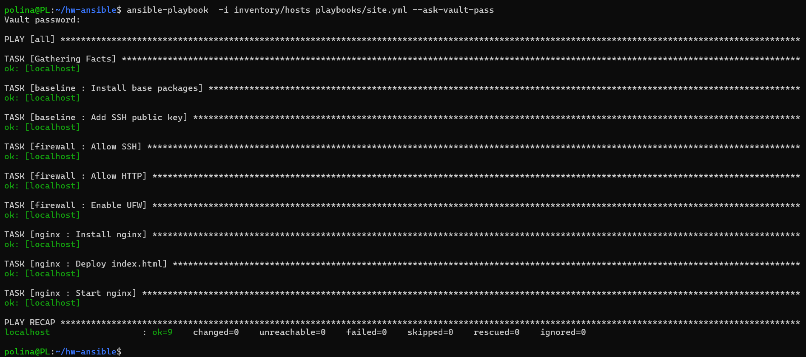

# 0. Prerequisites

1. Run WSL
2. Install requirements
```
sudo apt update
sudo apt upgrade -y
sudo apt install python3 python3-pip -y
sudo apt install ansible -y
sudo apt install python3-boto3 python3-botocore -y
```


# 1. Create the "baseline" role

Create the role and edit the main task
```
ansible-galaxy init roles/baseline
```


[roles/baseline/tasks/main.yml](hw-ansible/roles/baseline/tasks/main.yml)

# 2. Create the firewall role

```
ansible-galaxy init roles/firewall
```

[roles/firewall/tasks/main.yml](hw-ansible/roles/firewall/tasks/main.yml)

Create inventory/hosts

# 3. Create the nginx role

```
ansible-galaxy init roles/nginx
```

[roles/nginx/tasks/main.yml](hw-ansible/roles/nginx/tasks/main.yml)

Create html template roles/nginx/templates/index.html.j2
Used a variable for showing the server name.

```
mkdir group_vars
nano group_vars/all.yml
```

[group_vars/all.yml](hw-ansible/group_vars/all.yml)

# 4. Use dynamic inventory

```
mkdir inventory
nano inventory/aws_ec2.yml
```

[inventory/aws_ec2.yml](hw-ansible/inventory/aws_ec2.yml)

Create AWS access key from AWS console and store in nano ~/.aws/credentials
```
[default]
aws_access_key_id=KEY
aws_secret_access_key=SECRET
```

Create the ansible.cfg:
```
[defaults]
inventory = ./inventory/aws_ec2.yml
host_key_checking = False
remote_user = ubuntu
private_key_file = ~/.ssh/id_rsa
```

# 5. Use Ansible Vault for encrypting sensitive data
```
mkdir group_vars
ansible-vault create group_vars/secrets.yml
```
Enter the vault password and store smth in the file:

```
db_password: super_secret_password
```


For checking dynamic inventory:
```
ansible-inventory --list
```


It's not empty, so working correctly.

# 6. Configure several playbooks for different roles

```
mkdir playbooks
```

[playbooks/baseline.yml](hw-ansible/playbooks/baseline.yml)
[playbooks/firewall.yml](hw-ansible/playbooks/firewall.yml)
[playbooks/webserver.yml](hw-ansible/playbooks/webserver.yml)

full deploy: [playbooks/site.yml](hw-ansible/playbooks/site.yml)

# 7. Run playbooks

```
 ansible-playbook -i inventory/hosts playbooks/baseline.yml
```


```
ansible-playbook -i inventory/hosts playbooks/firewall.yml
```



```
ansible-playbook -i inventory/hosts playbooks/webserver.yml
```


Full deploy (with vault)
```
ansible-playbook  -i inventory/hosts playbooks/site.yml --ask-vault-pass
```

