# 1. Set up n8n locally
Created [docker-compose.yml](docker-compose.yml) and run
```
docker compose up -d
```
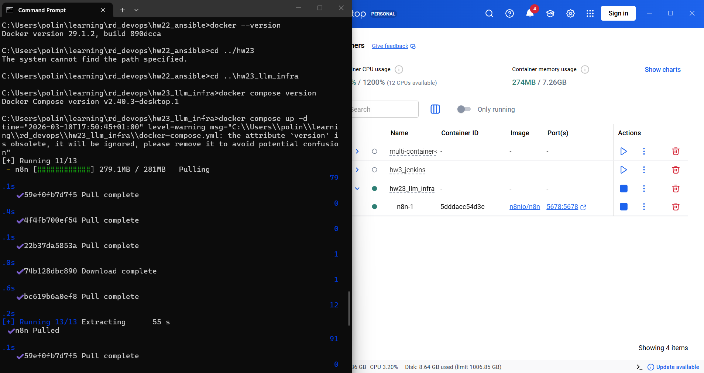

The n8n container is up and running:
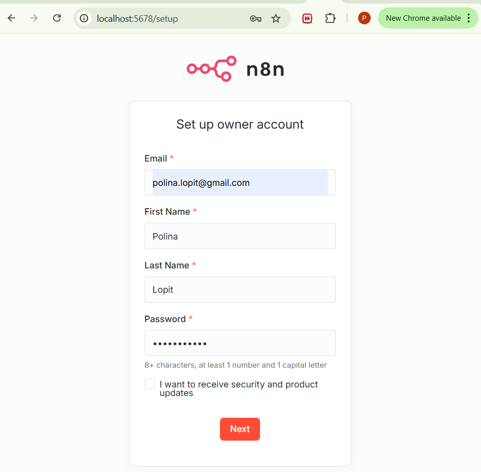

# 2. Create a Google form

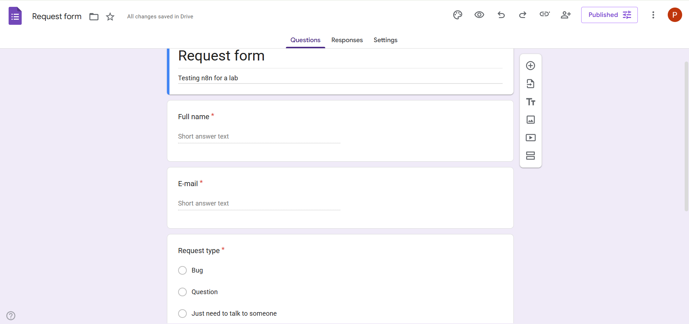

Resposnes -> Link to sheets -> Create a new google sheets.

# 3. Create a telegram bot
Create a bot via BotFather

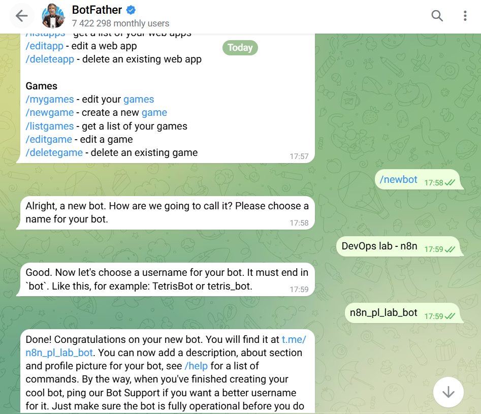

https://api.telegram.org/bot<TOKEN>/getUpdates

# 4. Create n8n workflow

1. In the n8n:
New workflow -> Add trigger -> Google Sheets -> On row added.
Credentials -> Create new credential -> Copy OAuth redirect URL.

2. Because I started a local docker container, I couldn't just log into Google Sheets. 
In Google Cloud:
APIs&Services -> Credentials -> Create credentials -> OAuth client ID

Configure consent screen (app name n8n-lab, and fill in emails).

Now we can create OAuth client.
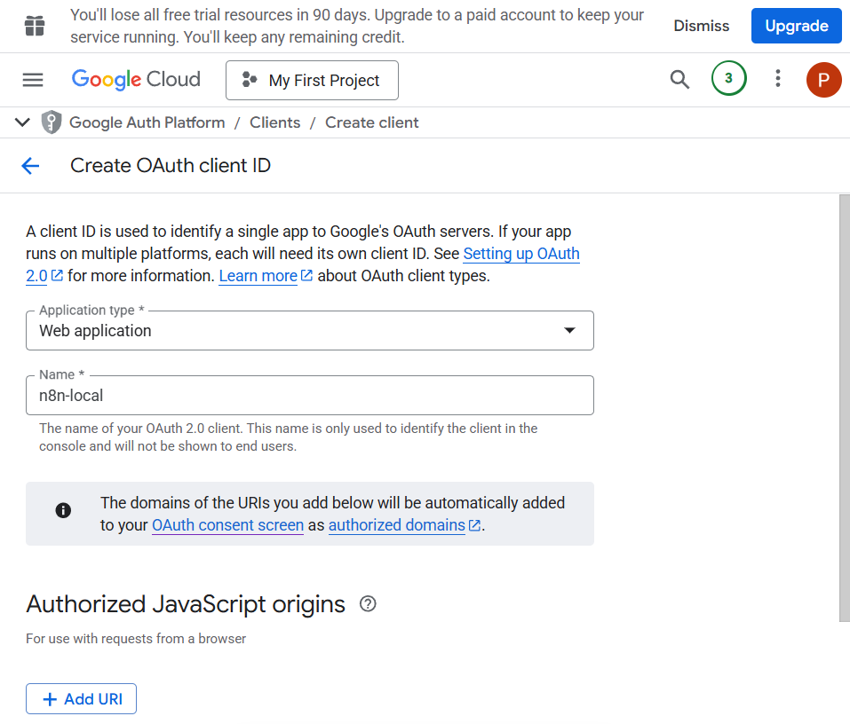

APIs&Services -> OAuth consent screen -> Audience -> test users -> add my email.

Authorized redirect URIs - paste the URI copied from n8n -> Create.

Copy Client ID and client secret to n8n -> Sign in to Google.
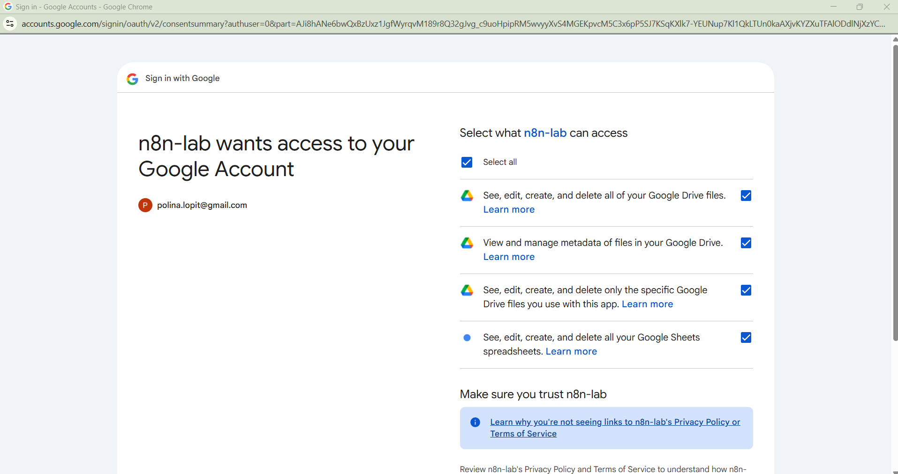
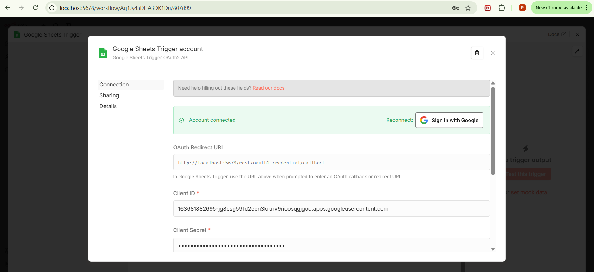

Enable Google drive API in google cloud.

FINALLY choose the document and sheet to finish the trigger:
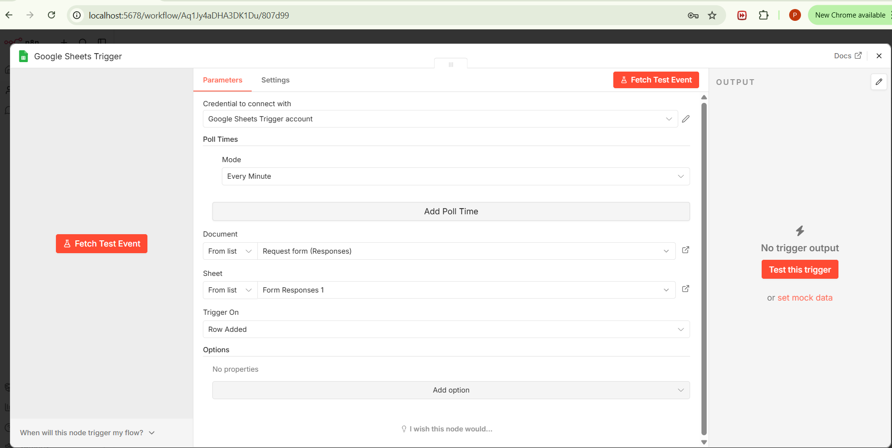

And after filling in the form, the result appeared in n8n:
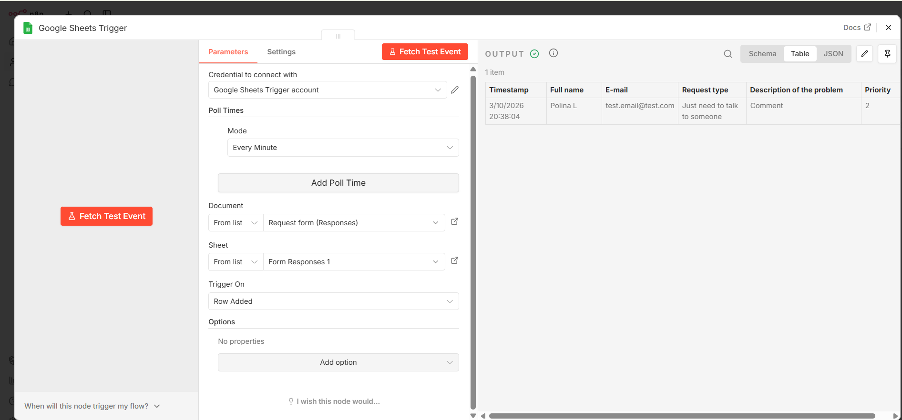
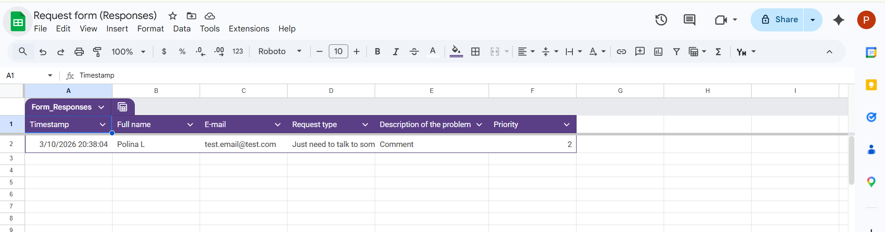

3. Lookup rows in the google sheet - check if the email exists

4. Add IF node

5. If the email exists - append row with status "duplicate"

6. If not - add telegram node. Paste chat ID and the bot token in credentioals.
In the settings - retry on fail.

7. Append row with status "Sent"
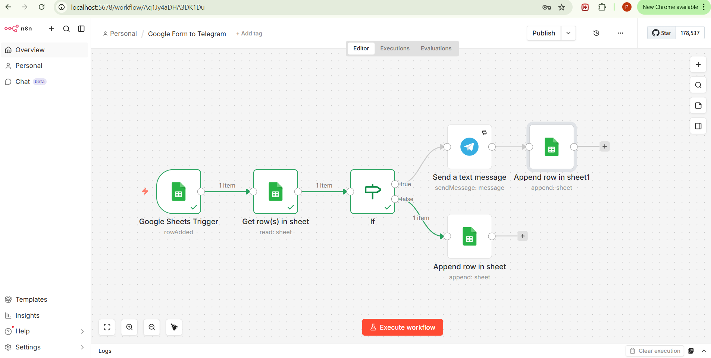


Current state:
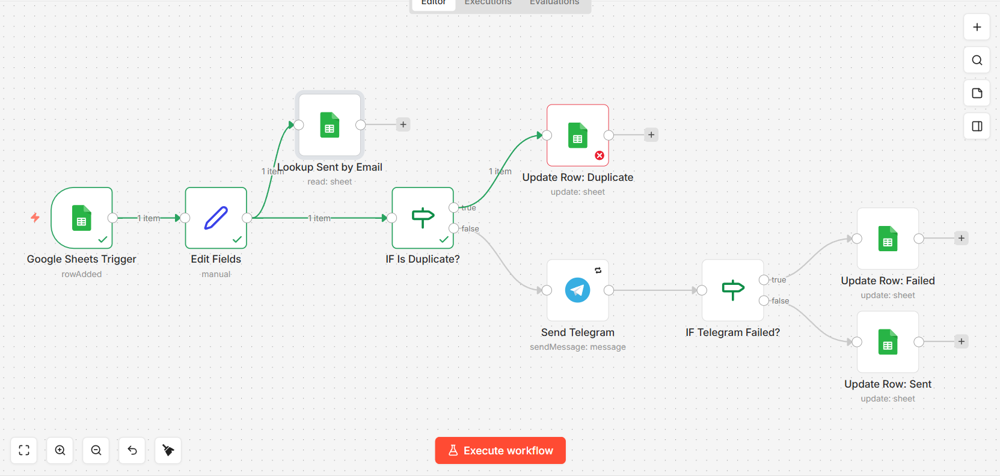
TODO: finish deduplication lookup, test telegram sent
