Task 1:  
\- Installed Docker  
\- Created file docker-compose.yaml  
\- Run from terminal in the directory with the docker-compose file:

\`\`\` docker compose up

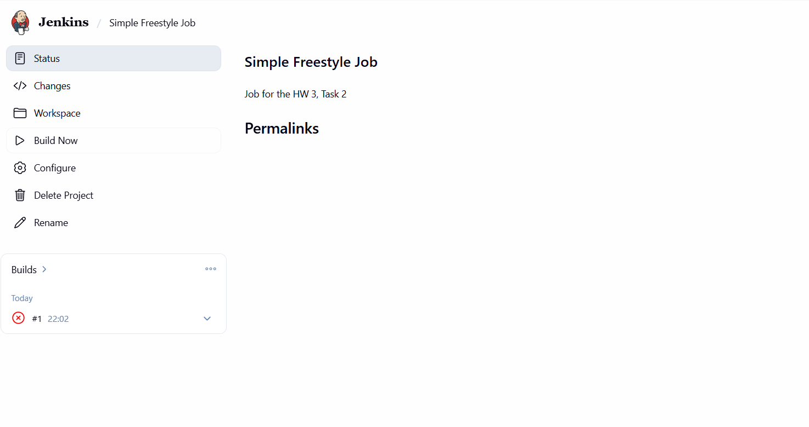

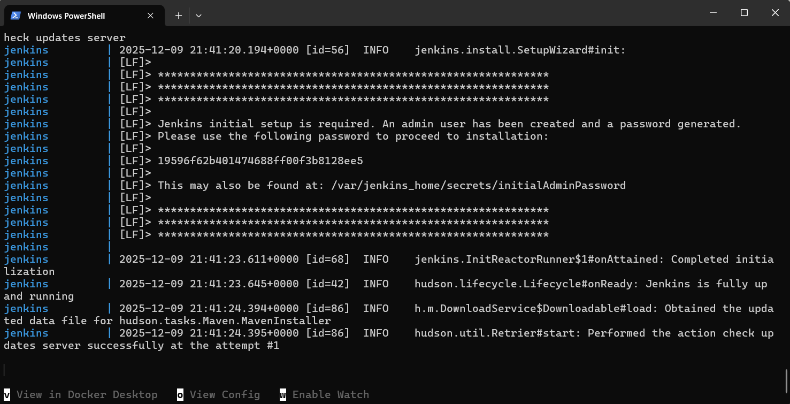

- Opened localhost:8080  
  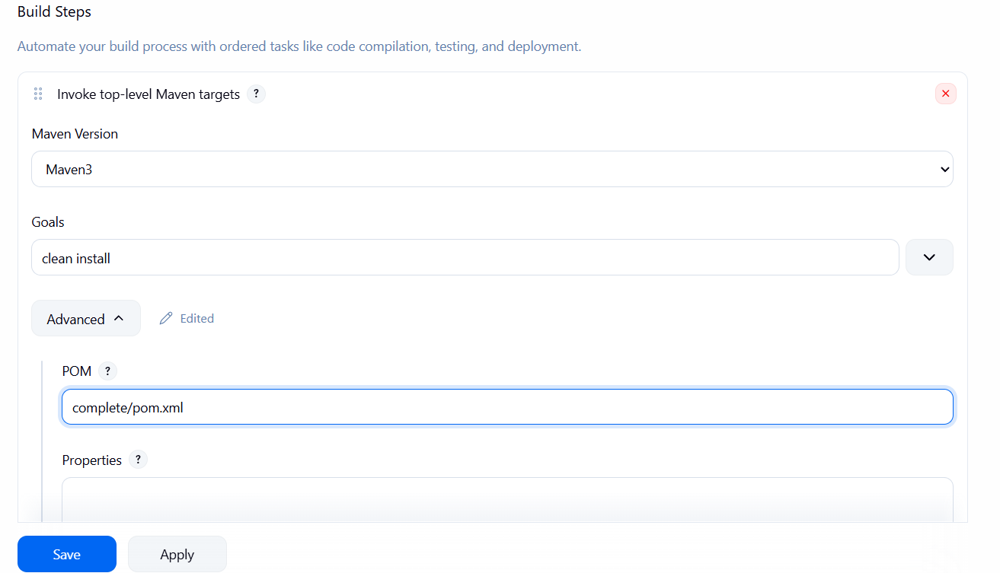
    
  Task 2:  
    
- Retrieved the password via  
  \`\`\` docker exec \-it jenkins cat /var/jenkins\_home/secrets/initialAdminPassword  
- Installed suggested plugins  
  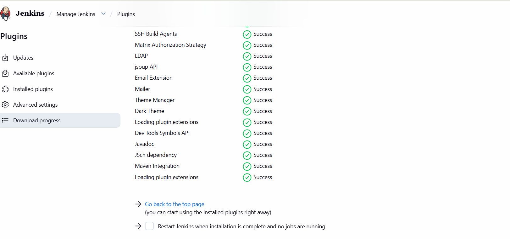
  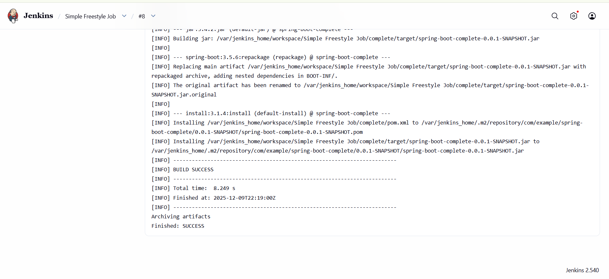 
  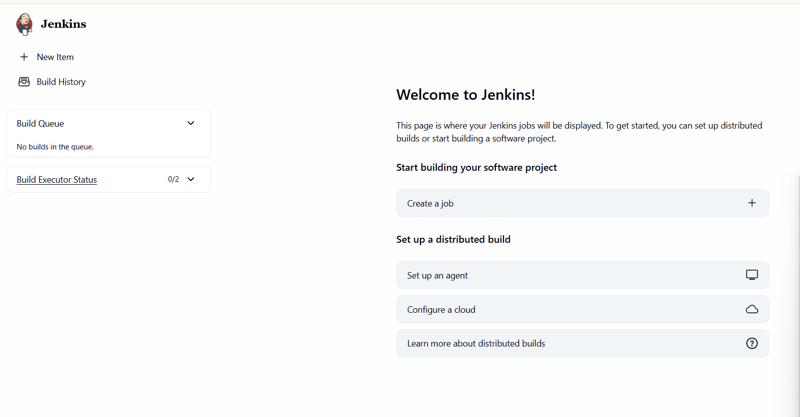
  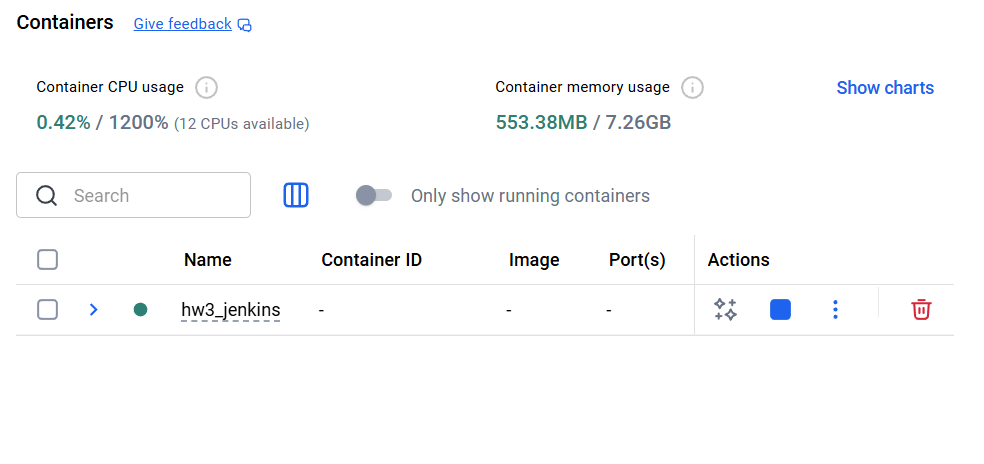
- Jenkins was missing Maven, so I added it in the settings (Tools \-\> Maven installations \-\> Add Maven)  
- Installed “Maven Integration” plugin  
  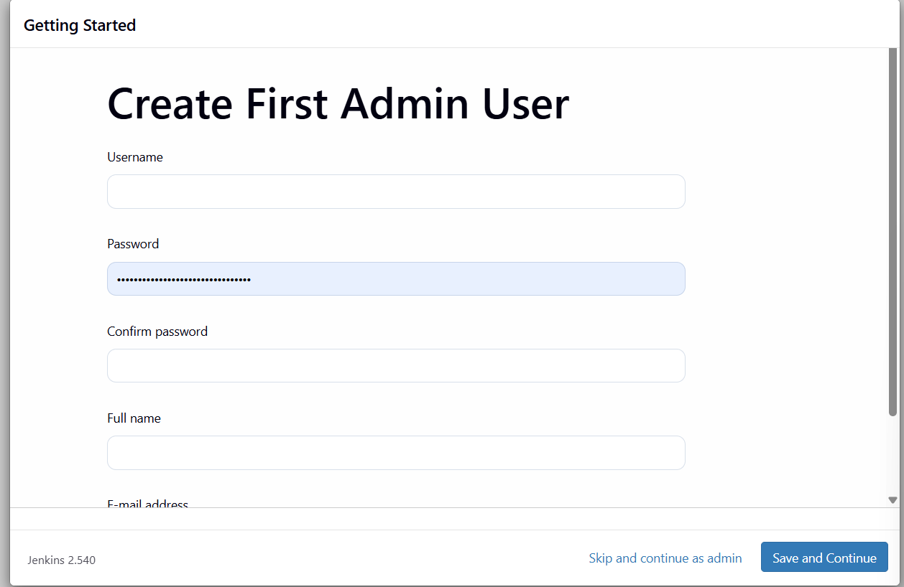 
- Restarted jenkins  
- Specified path to POM  
  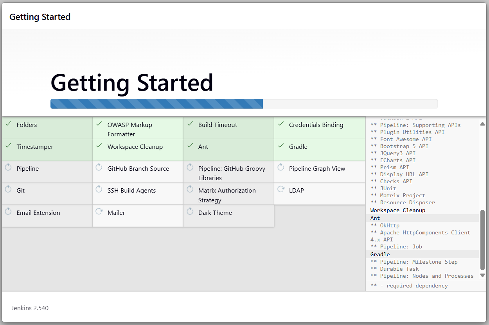
- 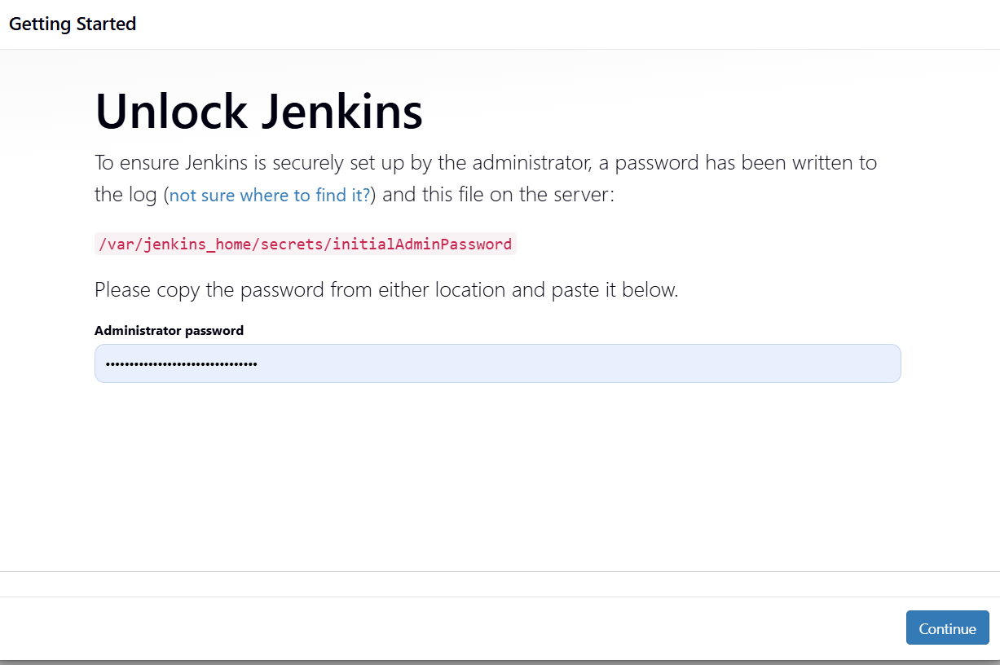
- 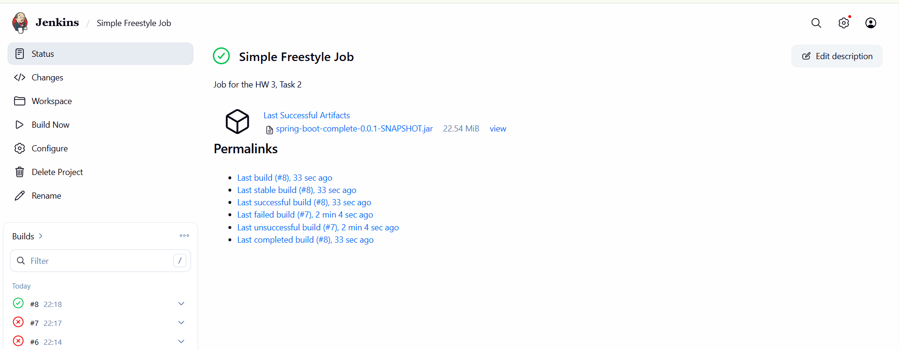

Task *

- Added Jenkinsfile to the root of the forked repo: https://github.com/lpvd/gs-spring-boot/blob/main/Jenkinsfile
(also added the file to this repo)
- In Jenkins added new Pipeline -> Pipeline script from SCM ->  Specified my forked repo and "main" branch
- Generated GH token
- Added credentials to the Jenkins instance
- 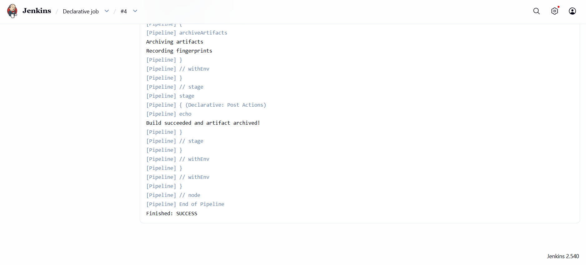
- 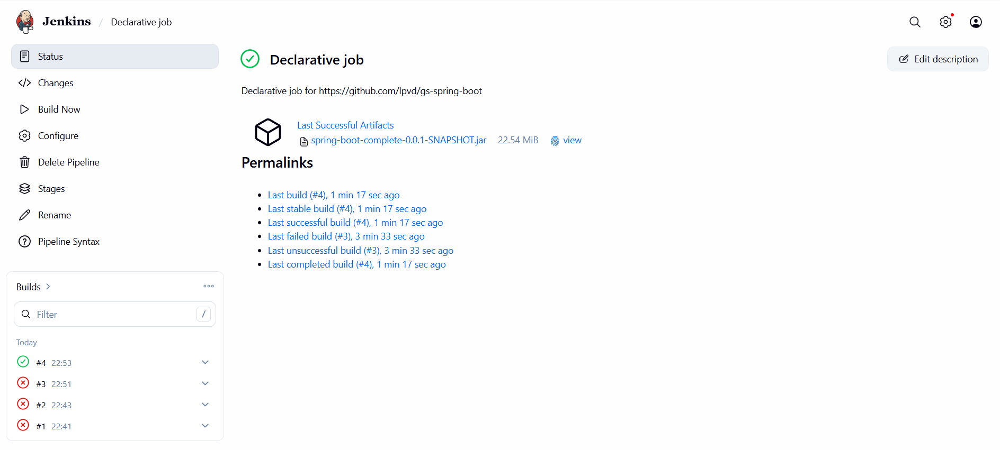