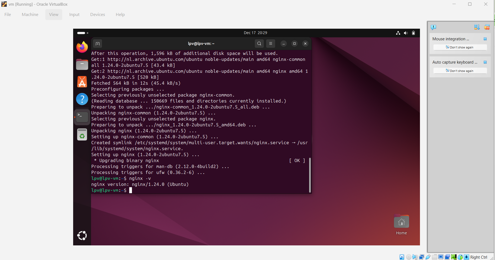
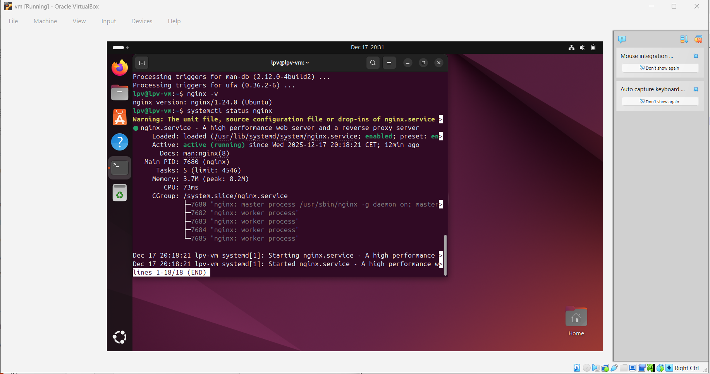
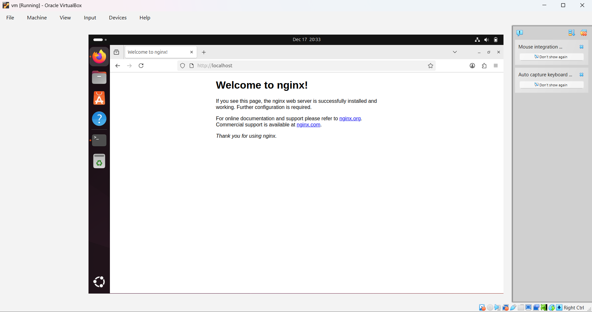
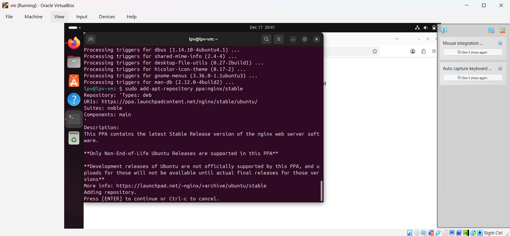
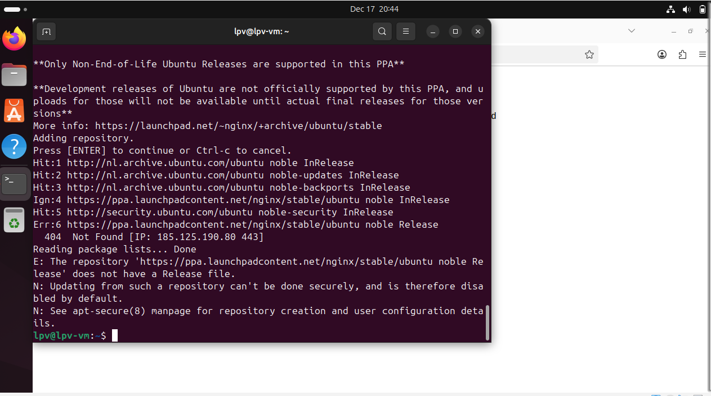
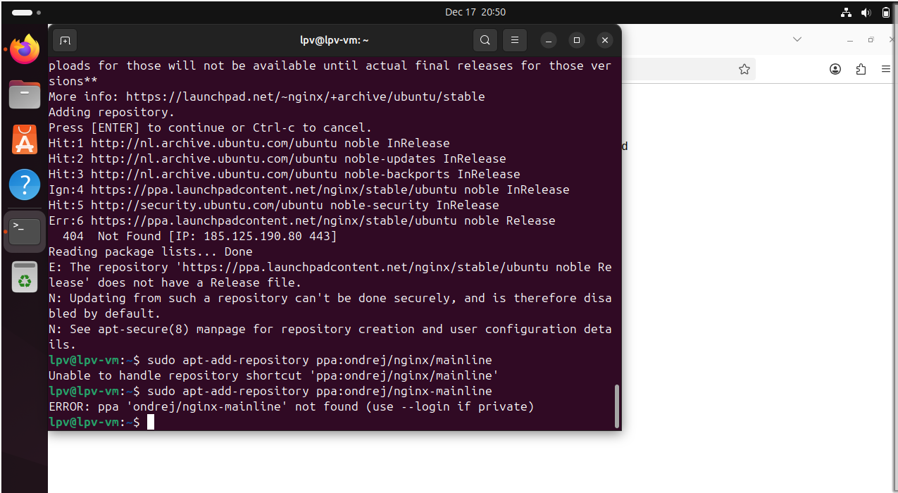
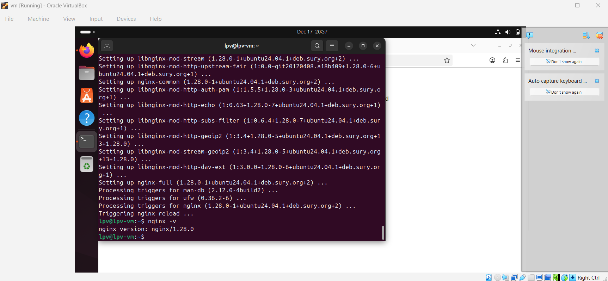
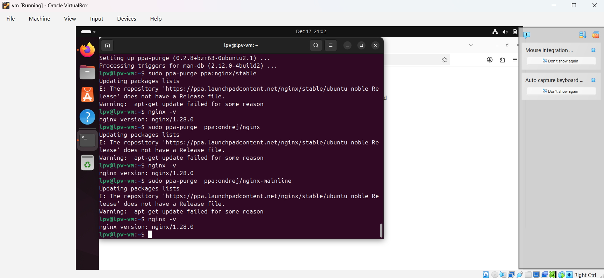
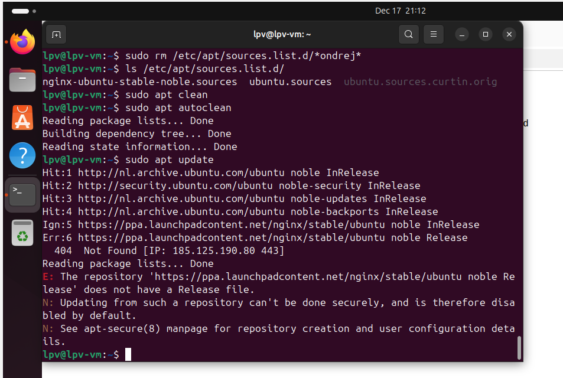

- Created VM
- Installed nginx:
sudo apt update
sudo apt install nginx -y
nginx -v

- Check status:
systemctl status nginx

- Open browser in the VM

- Installed utility to work with ppa:
sudo apt install software-properties-common -y

- Add ppa nginx/stable

- It didn't work :)

- Adding other ppa...
sudo add-apt-repository ppa:ondrej/nginx-mainline

And it's private.

- Tried adding 
sudo add-apt-repository ppa:ondrej/nginx
But got the same error as for the nginx/stable.

- I still run 
sudo apt install nginx-full
and it triggered nginx reload.

The version had changed, so it means we did update the nginx to the latest from the ppa.

- Returning to the official version.
Install ppa-purge
sudo apt install ppa-purge -y

Purge the ppa:
sudo ppa-purge ppa:nginx/stable

Which didn't work

Manually removing the ppa.

And manually removed and re-installed nginx.
sudo apt-get remove --purge nginx
sudo apt-get autoremove --Purge
sudo apt install -y nginx

So ppa-purge failed because it tries to run apt update, and it can't be finished because the release file is absent.
So it was just a broken ppa. 