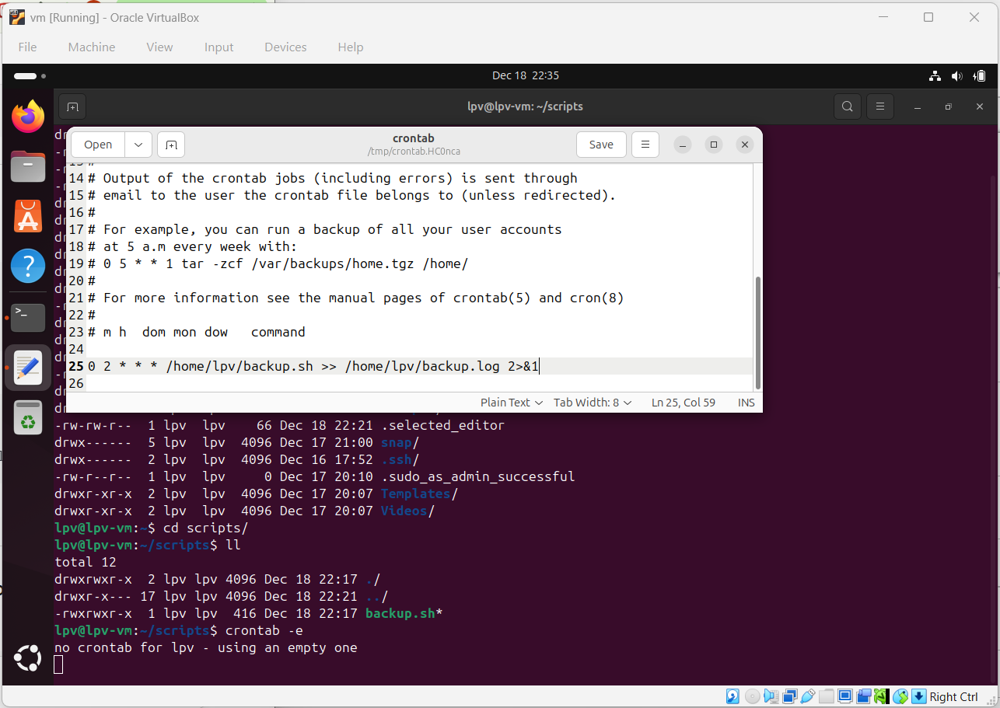
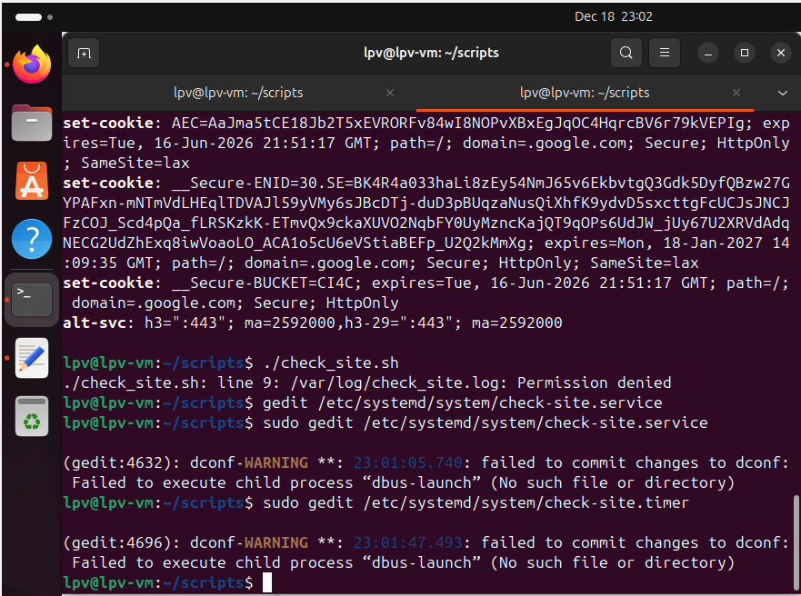
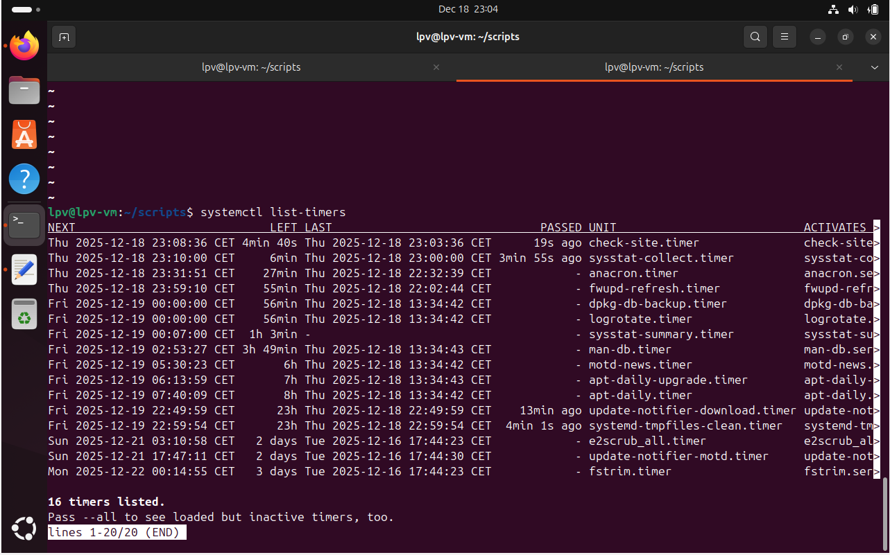
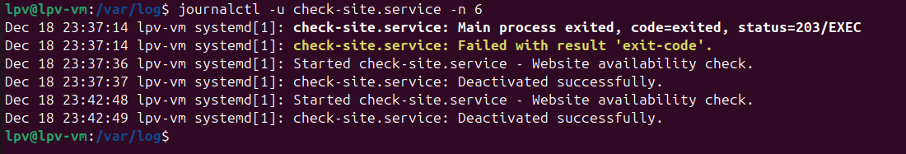
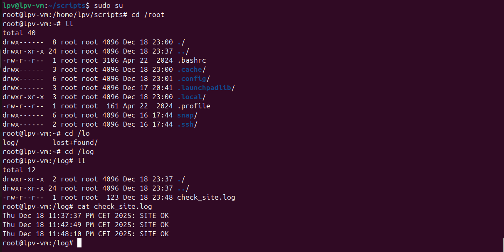
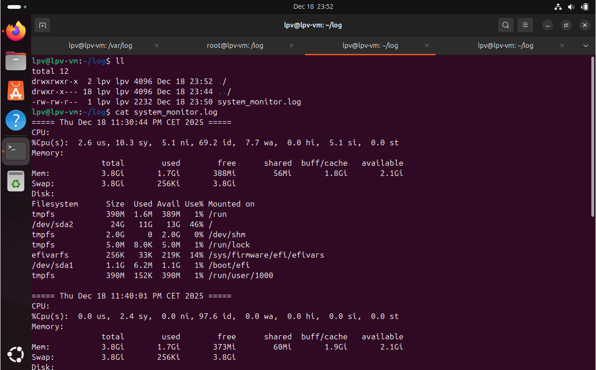
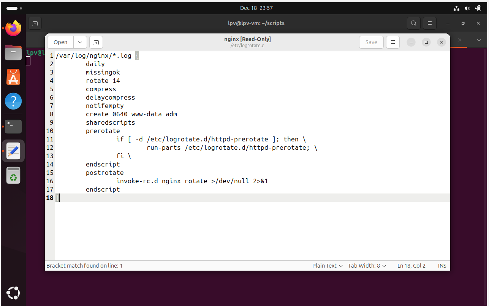
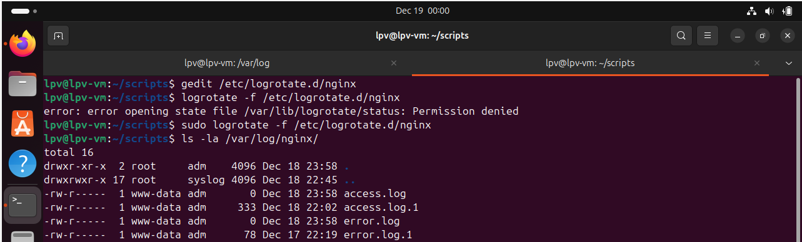

1. Wrote a bash script (backup.sh) for making backup copies from /home/user/data to /home/user/backup every day.
Added the script to this folder.

Made it executable
chmod +x ./backup.sh

Set  up cron job for this script to be executed every day at 2 am.

2. Created new systemd service to automatically run a script, which checks is google.com is available and writes it to a file.
Added a script (check_site.sh) to this folder.
Added service and timer files to this foler.

Set up the daemon:

Activated it:
systemctl daemon-reexec
systemctl enable --now check-site.timer

Check that it exists:

It ran every 5 mins:

3. Created new script (system_monitor.sh), added it to cron too.
crontab -e
*/10 * * * * /usr/lpv/scripts/system_monitor.sh

Logs from the script:

4. Rotate nginx's access Logs.
gedit /etc/logrotate.d/nginx

It already contained rotation rules for both error and access logs:

logrotate -f /etc/logrotate.d/nginx
