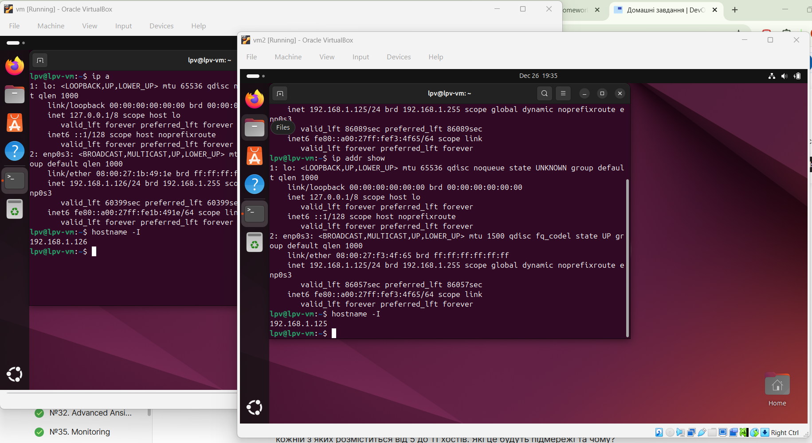
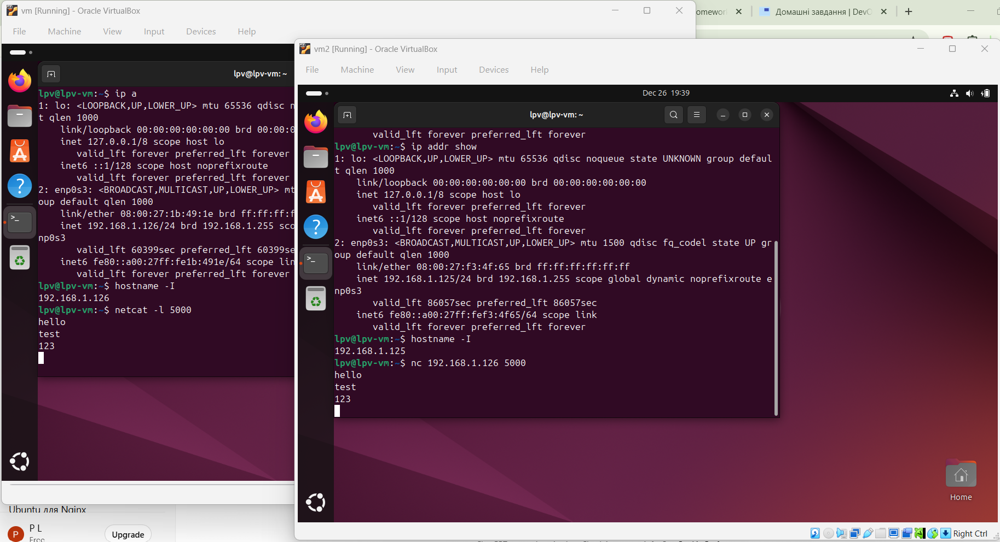
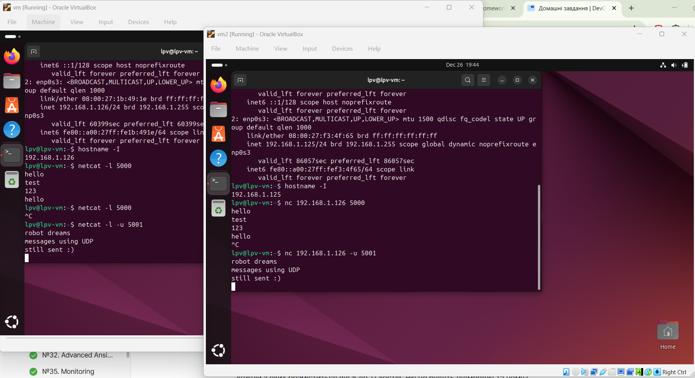
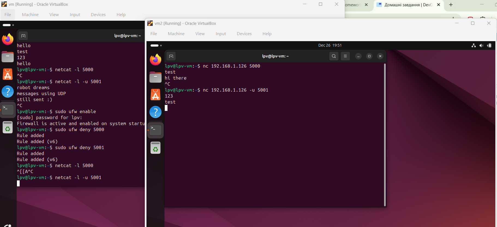
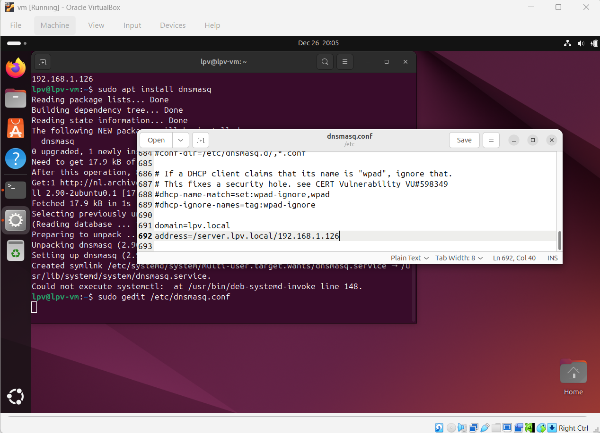
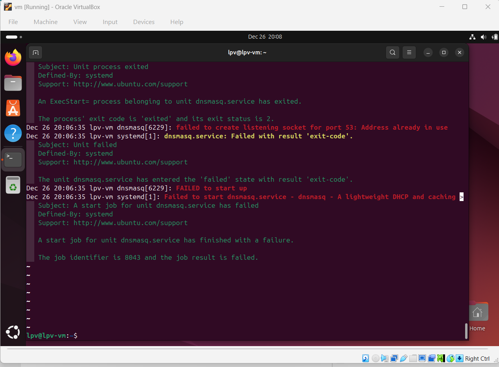
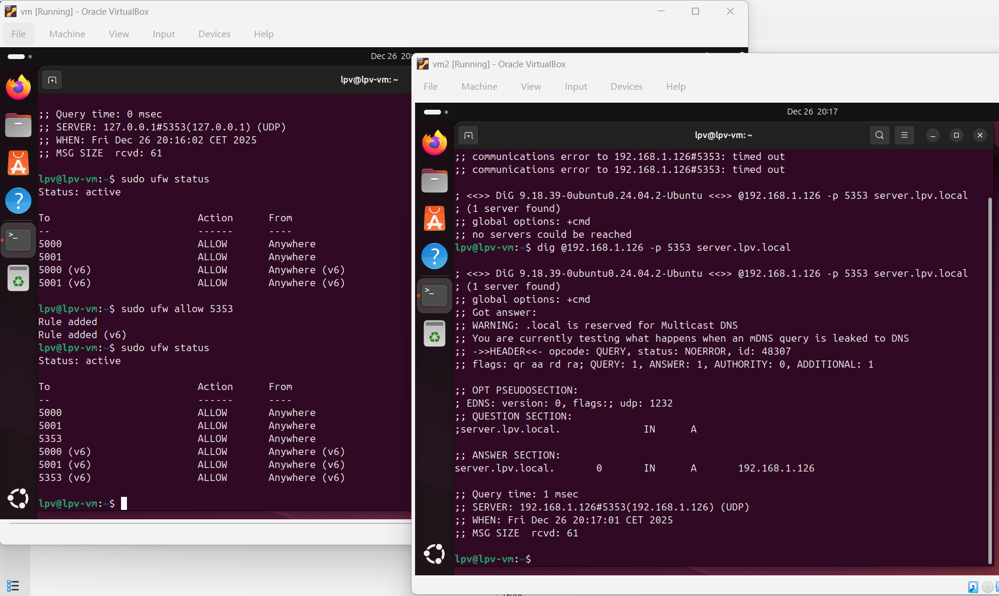

#Task 1: Establish connection via netcat

- Check IPs of the two VMs


- On vm start listetning to port 5000
```
netcat -l 5000
```
On vm2 connect to vm using IP address and port
```
nc <IP> 5000
```
This establishes TCP connection. After typing and pressing enter on vm2, the messages appear in vm.


- On vm start listetning to port 5001, but not using UDP
```
netcat -l -u 5001
```
On vm2 connect to vm using IP address and port
```
nc <IP> -u 5001
```
This establishes UDP connection. Same result as after establishing UDP (because we're lucky :) )


- Enable Uncomplicated Firewall and block port 5000
```
sudo ufw enable
sudo ufw deny 5000
sudo ufw deny 5001
```

Now even when vm is listening to the port, and client tries to connect and send packages, nothing happens.
But we know that for TPC connection was not even established (after killing nc on the client, nc on the server is not killed/stopped).


I then executed 
```
sudo ufw allow 5000
sudo ufw allow 5001
```
to restore the state on the vm.

#Task 2: Configure DNS

Run on the vm:
```
sudo apt update
sudo apt install dnsmasq
```
Configure the DNS:
```
sudo gedit /etc/dnsmasq.conf
```
And add to the file
```
domain=lpv.local
address=/server.lpv.local/192.168.1.126
```


Restart:
```
sudo systemctl restart dnsmasq
```

Failed to restart, because socket 53 is already in use.

I've changed port of dnsmasq in /etc/dnsmasq.conf to 5353:
```
port=5353
```
Then restart succeeded.

Check on the vm2:
```
dig @192.168.1.126 -p 5353 server.lpv.local
```
The dig (Domain Information Groper) is a command-line tool for querying Domain Name System (DNS) servers.
So the command makes a query to the DNS by its IP, requesting to resolve the server.lpv.local domain.
The server must look up configs that it stores and return a corresponding address.

At first it timed out, so on the server I tried to run
```
dig @127.0.0.1 -p 5353 server.lpv.local
```
which succeeded, so I run:
```
sudo ufw allow 5353
```
And then the `dig` on the client side did work:


#Task 3: Split into subnetwork.
##Analyze the task (existing network).

The company uses the network 10.0.0.0/8.
The mask translates as:
```
11111111.00000000.00000000.00000000 # binary
255.0.0.0 # decimal
```
So it means the first octet is the network, the rest three octets are for hosts.
It's minimal address (the network's address)
```
00001010.00000000.00000000.00000000
= 10.0.0.0
```
and maximum address (broadcast)
```
00001010.11111111.11111111.11111111
= 10.255.255.255
```

Existing subnetworks:
1) 
```
10.0.1.0/24
```
Mask /24 in bits is
```
11111111.11111111.11111111.00000000
= 255.255.255.0
```

Min addr:
```
10.0.1.0 =
00001010.00000000.00000001.00000000
```

Max addr:
```
00001010.00000000.00000001.11111111
= 10.0.1.255
```

2)
```
10.0.0.32/26
```

Mask /26 is:
```
11111111.11111111.11111111.11000000
= 255.255.255.192
```

So there are 6 bits for host addresses (32-26=6). Size of the subnetwork is 2^6=64 addresses.

Min addr:
```
00001010.00000000.00000000.00100000
= 10.0.0.32
```

Broadcast:
```
00001010.00000000.00000000.00111111
= 10.0.0.95

```

So the range is
```
10.0.0.32 – 10.0.0.95
```

## Subnetting

We need to create 10 subnets, each must have 5-11 hosts.

So each subnet must have at least 11 addresses + broadcast + the network's address.

So mask /32 has 0 host addresses
/31 = 2^(32-1) = 2^1 = 2 addresses
/30 = 2^2 = 4 addresses
/29 = 2^3 = 8
/28 = 2^4 = 16 -> this is enough size of a subnet (4 bits for host addreesses).
So each subnet shall have "offset" of 16 addresses from one another.

We must not overlap with the existing subnets
```
10.0.1.0/24 -> 10.0.1.0 – 10.0.1.255
10.0.0.32/26 -> 10.0.0.0 – 10.0.0.95
```

** Subnet 1 **

Let's start with
```
10.0.0.128
00001010.00000000.00000000.10000000
```
There are no addreeses of existing subnets.
Range of addresses for the first subnet:
```
00001010.00000000.00000000.10000001 - 00001010.00000000.00000000.10001110
10.0.0.129 - 10.0.0.142
```
And broadcast:
```
00001010.00000000.00000000.10001111
10.0.0.143
```

** Subnet 2 **

+16 addresses from the beginning of the first subnet
```
10.0.0.144
00001010.00000000.00000000.10010000
```

... and so on :) 

Summary of the subnets:

| № | Subnet (CIDR) | Last octet, binary | Range for host addresses | Broadcast |
|---|------------------|-------------------------------------|-----------------|-----------|
| 1 | 10.0.0.128/28 | 10000000 | 10.0.0.129 – 10.0.0.142 | 10.0.0.143 |
| 2 | 10.0.0.144/28 | 10010000 | 10.0.0.145 – 10.0.0.158 | 10.0.0.159 |
| 3 | 10.0.0.160/28 | 10100000 | 10.0.0.161 – 10.0.0.174 | 10.0.0.175 |
| 4 | 10.0.0.176/28 | 10110000 | 10.0.0.177 – 10.0.0.190 | 10.0.0.191 |
| 5 | 10.0.0.192/28 | 11000000 | 10.0.0.193 – 10.0.0.206 | 10.0.0.207 |
| 6 | 10.0.0.208/28 | 11010000 | 10.0.0.209 – 10.0.0.222 | 10.0.0.223 |
| 7 | 10.0.0.224/28 | 11100000 | 10.0.0.225 – 10.0.0.238 | 10.0.0.239 |
| 8 | 10.0.0.240/28 | 11110000 | 10.0.0.241 – 10.0.0.254 | 10.0.0.255 |
| 9 | 10.0.2.0/28   | 00000000 | 10.0.2.1 – 10.0.2.14     | 10.0.2.15  |
|10 | 10.0.2.16/28  | 00010000 | 10.0.2.17 – 10.0.2.30    | 10.0.2.31  |

